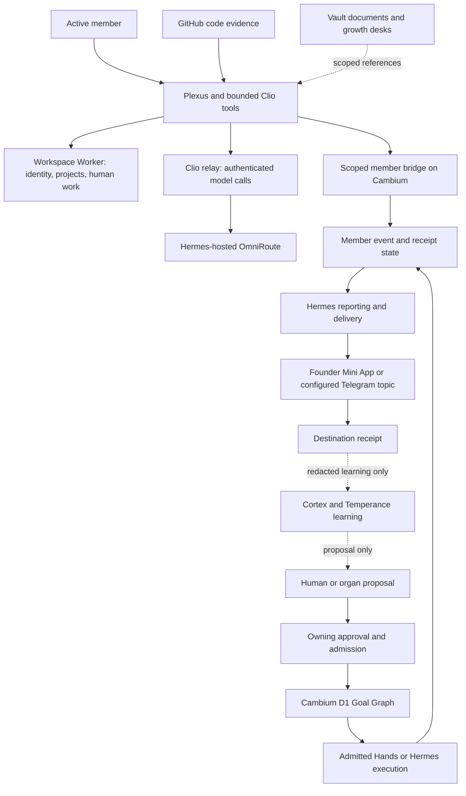

# P7 onward — Plexus connected operations

Status: published phase roadmap, 2026-09-05. P6 remains the active phase.
This packet extends acceptance coverage; it does not authorize deployments,
provider changes, remote writes, paid generation, public sends or bulk ingestion.
Acceptance lives in [ISA](../../ISA.md), ISC-271–304. Historical release criteria
keep their original IDs and scope. Counts are not a product-readiness percentage.

## Intended outcome

An active member signs in, sees only assigned canonical projects, performs and
records work, uses governed Clio assistance, and sends attributable evidence.
The shared data plane preserves human state; Cambium admits company work;
Hermes executes/delivers within that admission; the founder sees a real receipt.
Retries, revocation, account switches and offline recovery must not change the
actor, tenant, project or approval boundary.

## Authority and organ map

| Concern | Owner | Plexus relationship |
| --- | --- | --- |
| Human identity, tasks, time, capacity, leave, holidays, team signal | Plexus product; shared Workspace Worker/D1 persistence | Employee/admin UI and bounded main-process operations |
| Canonical project/client identity and mappings | TeamForge-named Worker/D1 | Consume authoritative mappings; local cache cannot admit projects |
| Company/tenant missions and admitted work | Cambium D1 Goal Graph | Link human work to admitted WorkObjects; no competing graph writer |
| Durable briefs, policies, brand and growth desks | Company vault | Read approved scoped pointers; Git carries notes across machines |
| Code and engineering evidence | GitHub | Selected-repository App authorization; traceable artifact references |
| Genesis, Taste, Hands, Will, Cortex | Cambium composition contracts | Consume relevant outputs/propose work; no extra desktop organs required |
| Vestibule, Adytum, Nutrix, Auspex, Circulator, Praeceptor | Temperance lifecycle contracts | Orientation, health and recommendations; never implicit work admission |
| Model routing | OmniRoute on the relevant host | Clio relay is a separate authenticated desktop entry point |
| Admitted execution and external receipt | Hermes; Superset for admitted local repository work | Human UI is neither model router nor Telegram command bus |
| Organ console and capability cards | Read-only or design-held projections | Optional later surfaces; not human-task state or release prerequisites |

This is the target ownership flow, not proof every arrow works today. Ordinary
Plexus human-state writes do not become Goal Graph writes. Only crossing into
admitted company/agent work requires the corresponding graph/action authority.

## Reviewed findings

| Boundary | Current source/evidence | Remaining gap |
| --- | --- | --- |
| Release/account migration | API source targets Labs; P6 records legacy OTA and divergent feeds | Finish P6 transport, object parity, protected bridge and both installed cohorts |
| Identity | Role-aware Access session and separate scoped bridge credential exist | Bind Access actor/workspace to bridge tenant/member; logout/account-switch invalidation; inactive-member behavior |
| Project mapping | Worker sync and vault project_id matching exist | Cache provenance/freshness, removed/revoked rows, clientId retention and explicit WorkObject link |
| Cambium identity gate | Focused resolver tests pass 18/18 in reviewed local source | Production audience/URL configuration, role/resource restrictions and revocation-cache acceptance |
| Clio inference | Authenticated catalog/stream source; desktop contract still uses te-* | Prove compatible deployed catalog and streamed turn; keep Mac noesis routing distinct |
| Clio operator breadth | Bounded intents and read tools exist | Vault promises broader mapping/parity/secrets operator duties than the verified tool surface; admit exact capabilities individually |
| Daily work evidence | Local context, event outbox, bridge-first delivery and fallback exist | Full-day totals beyond 50 records; GitHub proof lineage; recipient receipt and receiver deduplication |
| Monthly review | Plexus expects a Hermes activation and emits member_review_cycle | Locate/implement matching activation and downstream consumer; prove a closed-month receipt |
| Human task UI | Inbound bridge tasks and mutation APIs exist | Employee assignment-to-completion UI and native human planning state; not merely an assignment summary |
| Capacity, leave, holidays | Vault assigns ownership to Plexus | No complete native workflows found; implement product/API/data/UI contracts |
| Team collaboration | Room/presence/media client wiring exists | Separate team-signal behavior from employment is_active; prove real delivery and privacy |
| Realtime | Client peer connections and project media enabled | Canonical Worker revision, provider negotiation, two-client media, authorization/audit and teardown |
| Recording | Preload APIs have no matching main handlers | Explicitly withhold unavailable actions, or separately implement consent/storage/retention; transcription stays deferred |
| Growth/organ loop | Vault design/contract sources exist, some only local | No automatic execution, growth write-zone expansion, social publishing or vault-to-Cortex ingestion |

Detailed source anchors and snapshot limits are in the
[review receipt](../../docs/evidence/2026-09-05-connected-operations-review.md).

## Dependency-ordered work

The initial review used W0–W6 labels. The published phase numbers below are the
execution authority; W0 is a baseline activity within P7, not an extra phase.
See the [issue roadmap](../GITHUB_ROADMAP.md) for exact dependencies and owners.

| Phase | Work and owner | Acceptance | Dependencies / parallel work |
| --- | --- | --- | --- |
| [P6](P6-labs-migration-acceptance.md) | Plexus release owners: route, object parity, signing and both update cohorts | Historical release criteria plus ISC-255–262 | Active phase; exact object inventory can prepare while signing/access gates remain |
| P7 (this packet; former W0/W1) | Plexus + Worker + Cambium: canonical baseline, actor/bridge binding, project provenance/revocation, App permissions and WorkObject admission | ISC-271–277 plus historical App/D1 criteria | Cambium admission contract starts locally; final Plexus mapping acceptance depends on that contract, then actor binding. Inventory and fixtures can prepare in parallel |
| [P8](P8-governed-clio.md) (former W2) | Plexus + Hermes relay: compatible catalog/stream, bounded capability map and truthful status | ISC-278–281 | Capability contracts can start locally; live transport needs P7 actor proof |
| [P9](P9-reporting-receipts.md) (former W3) | Plexus + Cambium bridge + Hermes: full-day evidence, GitHub lineage, receipt/deduplication, monthly cycle and closeout | ISC-282–287 | Daily path depends on P7 identity/App acceptance and Hermes receipt work; monthly and closeout follow daily |
| [P10](P10-human-operations.md) (former W4) | Plexus + Workspace Worker: task lifecycle, capacity, leave, holidays and team signal | ISC-288–293 | Actor boundary first; calendar/quota contract precedes capacity arithmetic; UI fixtures may prepare independently |
| [P11](P11-realtime-acceptance.md) (former W5) | Plexus + canonical Worker: SFU, privacy/audit, truthful recording and teardown | ISC-294–296; existing issues #26/#23 | Privacy fixtures can start locally; live media needs actor/Worker/provider proof |
| [P12](P12-installed-acceptance.md) (former W6) | Signed candidate + service owners: installed journey, recovery, privacy and admission invariants | ISC-297–300 plus P6 | First installed slice depends on P6, P7, P8 and daily P9; full monthly, HR and Realtime follow separately |

The first useful slice is **P6 + P7 + P8 + daily P9 → P12**. Monthly reporting,
full HR/planning and Realtime remain explicit later slices. Keep every pending
criterion visible while accepting each declared slice against exact receipts.

Cambium’s contract/negative-fixture handoff unblocks mapping implementation. Paired
integration and production configuration receipts follow jointly under ISC-277;
they are not an exit prerequisite for the supporting contract package.

## First slice acceptance packet

Use synthetic fixtures before real member/tenant data. Name one active employee,
one founder, one inactive/denied actor, one canonical project and one explicitly
selected GitHub repository. The packet must record:

1. Exact installed app digest and deployed/configured service revisions.
2. Access identity, bridge identity and canonical project binding without secrets.
3. An authenticated Clio catalog and content-bearing stream; rejected route/model
   and unauthorized actor cases have zero unintended action.
4. A task/work record linked to GitHub evidence; a >50-entry day verifies full
   aggregation rather than model-context truncation.
5. A stable event ID across retry, one recipient result, and a destination receipt
   distinct from HTTP acceptance or the Worker fallback.
6. Offline/restart, account switch and revoked-project cases preserve local work
   while preventing stale authority from executing or reporting as another actor.
7. Founder visibility and privacy match the approved audience; no raw HR, secrets
   or private source bodies enter Telegram, Cortex or model context by default.

## Growth-specific constraints

The growth department is Will's vault-owned workspace. Genesis supplies brand
pointers, Taste evaluates, Hands uses an admitted loadout, Will prepares GTM, and
Cortex retrieves approved/redacted evidence. None can approve its own work.

- The August execution map is explicitly a goal. Its old lane/default counts are
  dated, and exact runtime values need fresh owner-scoped reads.
- Labs Worker Access and the Clio relay's red-queen Access contract are distinct.
  Do not assume a shared issuer; any relay migration requires coordinated source,
  configuration, tests and authenticated acceptance. Do not globally replace
  te-* with noesis-*.
- The whitepaper project-map JSON currently lists Cambium only. It is not proof
  Plexus is enrolled into an executable organ workflow.
- The organ atlas and capability-hit files are local/untracked in the inspected
  vault. Hermes cannot see them through Git until the vault owner publishes them
  to the sole canonical transport and verifies EC2 readback.
- Growth is outside Bridge A's current write zones; keep Hermes output in existing
  admitted zones. A local draft is not permission to write growth cells remotely.
- Capability-hit delivery is design-only/disabled. Keep it separate from member
  reports; empty or stale evidence produces no broadcast.
- Do not duplicate six Will desks as six new services, install retired helpers,
  treat employment is_active as realtime presence, or ingest the whole vault.

## Backlog reconciliation and handoff

GitHub open-issue inventory at review time contains #23, #26 and #147. The latter
is fixed on the pushed documentation branch, but remains open; merge and issue
closeout were not performed. These three issues do not cover the full product gap.

Keep the 22 pre-existing open ISCs. Historical ISC-239 is a failed old-version
journey, not a command to republish v0.7.7. Resolve old criteria with an explicit
supersession/disposition record; never silently mark them passed because a newer
release works. Existing App/signing/D1/secret tasks remain user-owned.

New operational criteria stay unchecked. Split work into owner-repository tasks
with source base, intended edit set, fixtures, rollback and live acceptance before
execution. This plan is maintained here; sibling repositories and the vault have
not been edited by the review.

## GitHub work packages

Phase epic: [P7](https://github.com/Sheshiyer/plexus-ts/issues/149). Current links and dependencies: [GitHub roadmap](../GITHUB_ROADMAP.md).

- [P7-MAPPING](https://github.com/Sheshiyer/plexus-ts/issues/160): Pin service revisions and authoritative project mappings — Blocked dependency.
- [P7-ACTOR](https://github.com/Sheshiyer/plexus-ts/issues/161): Bind member identities and enforce revocation across sessions — Blocked dependency.
- [P7-APP-PERMISSIONS](https://github.com/Sheshiyer/plexus-ts/issues/162): Reconcile least-privilege GitHub App permissions — Operator gate.
- [P7-APP-ACCEPTANCE](https://github.com/Sheshiyer/plexus-ts/issues/163): Verify selected repositories and founder connection end to end — Blocked dependency.
- [P7-CAMBIUM](https://github.com/Sheshiyer/cambium/issues/371): Validate Plexus WorkObject references at the Cambium boundary — Ready local.
