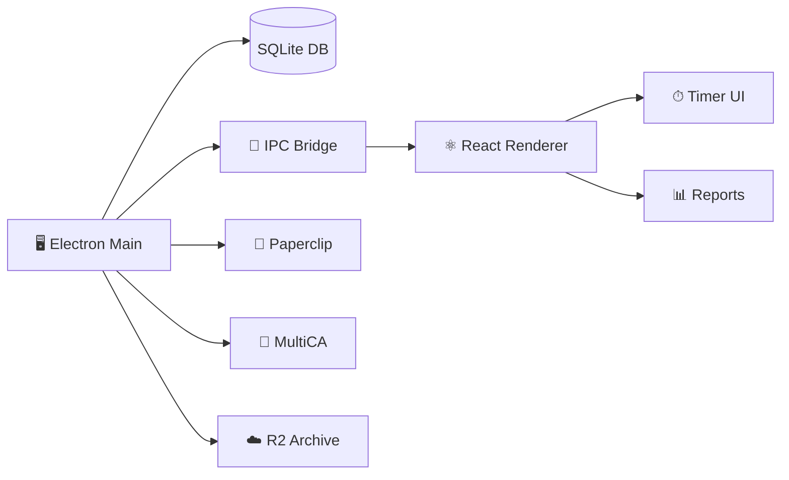

<div align="center">


</div>

<p align="center">
  
  
  
  
</p>

<p align="center">
  
</p>

---

> **Plexus** is the native time-tracking cockpit for Thoughtseed agents. Start timers, manage projects, generate reports — then bridge everything into Paperclip, MultiCA, TeamForge, and R2 for org-wide visibility.


## ✨ Features

<table>
<tr>
<td width="50%" valign="top">

### ⏱ One-Click Timer
Start, stop, and switch between projects instantly. Running timers persist across app restarts.

</td>
<td width="50%" valign="top">

### 📁 Project Management
Color-coded projects with client names, hourly rates, and billable flags.

</td>
</tr>
<tr>
<td width="50%" valign="top">

### 📝 Manual & Timed Entries
Log time manually for back-filling or use the live timer for real-time tracking.

</td>
<td width="50%" valign="top">

### 📊 Daily / Weekly / Monthly Reports
Instant visual breakdowns with billable vs non-billable splits and project aggregates.

</td>
</tr>
<tr>
<td width="50%" valign="top">

### 🔌 Paperclip Bridge
Sync time entries directly into the Paperclip vault so agents can read member work.

</td>
<td width="50%" valign="top">

### 🌉 MultiCA → TeamForge → R2
Push reports upstream to cofounders and archive monthly snapshots to Cloudflare R2.

</td>
</tr>
</table>


## 🚀 Quick Start

```bash
git clone https://github.com/Sheshiyer/plexus-ts.git
cd plexus-ts
npm install
npm run dev
```

**Build for production:**

```bash
npm run build
```


## 🏗 Architecture



### Process Model

| Process | Responsibility | Port |
|---------|---------------|------|
| **Main** | SQLite, file I/O, bridge APIs, timer ticker | — |
| **Preload** | Typed `contextBridge` exposing `window.plexus` | — |
| **Renderer** | React UI, charts, user interactions | Vite dev |

Security: `contextIsolation: true`, `nodeIntegration: false`, `sandbox: true`.


## 📂 Project Structure

```
plexus-ts/
├── src/
│   ├── main/           # Electron main process
│   ├── preload/        # contextBridge preload script
│   ├── renderer/       # React UI (Vite)
│   │   ├── components/
│   │   │   ├── Timer.tsx
│   │   │   ├── ProjectManager.tsx
│   │   │   ├── TimeEntryList.tsx
│   │   │   ├── Reports.tsx
│   │   │   └── BridgePanel.tsx
│   │   ├── App.tsx
│   │   └── main.tsx
│   ├── db/             # SQLite schema & queries
│   ├── bridge/         # Paperclip, MultiCA, R2 adapters
│   └── shared/         # Types & contracts
├── dist/               # Compiled output
├── package.json
├── tsconfig.json
├── vite.config.ts
└── README.md
```


## 🔌 Bridge Integrations

### Paperclip
Writes markdown time-reports into `vault/communications/time-reports/{memberId}-{month}.md` so CEO, Synthesist, and other agents can read employee work.

### MultiCA
Pushes structured `time_report` messages to the upstream bridge endpoint. Cofounders see aggregated member time in the MultiCA dashboard.

### TeamForge
MultiCA forwards meso-level time insights into TeamForge, feeding standup KPIs and sprint planning.

### R2 (Cloudflare)
Monthly JSON snapshots are archived to R2 for durable, long-term storage and compliance.


## 🛡 Security

- Renderer is **untrusted** — no Node access
- All IPC payloads validated in main process
- SQLite WAL mode for atomic writes
- Settings stored in `~/.plexus/plexus.db`
- No remote content loaded with Node privileges


## 📜 License

MIT © Thoughtseed

<div align="center">


**Built with ❤️ by Thoughtseed**

</div>
