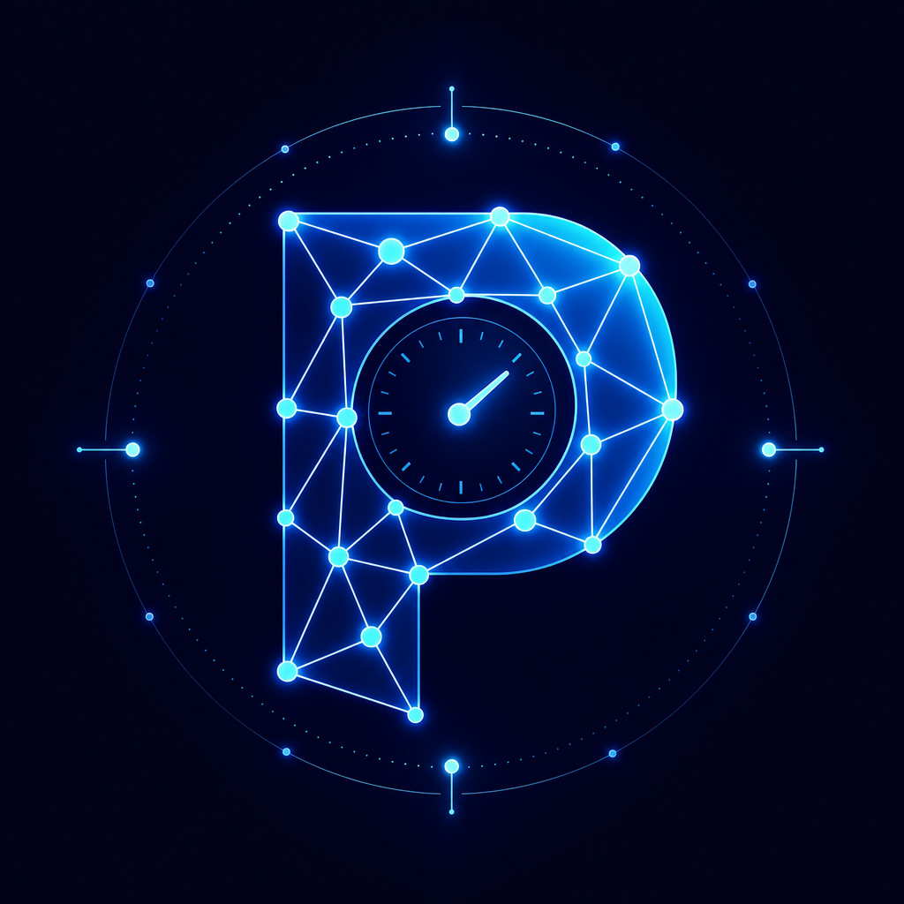
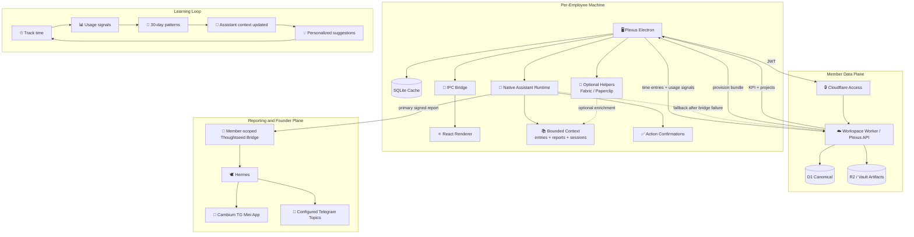

<div align="center">


</div>

<p align="center">
  
</p>

<p align="center">
  
  
  
  
</p>

<p align="center">
  
</p>

---

> **Plexus** is the native work coordination layer for Thoughtseed employees. Each person gets a **local-per-member native assistant runtime** that can read bounded local work context, group local AI sessions, suggest existing app actions, and report through a member-scoped Thoughtseed bridge to Hermes — with **no plaintext renderer or infrastructure-wide secrets** and **email-only login**.
>
> Plexus is not a port of the founder's Paperclip setup. It is a **synthesis platform**: the native assistant is the center, and Fabric/Paperclip is an optional helper layer for enrichment, diagnostics, and vault context when available.


## ✨ Features

<table>
<tr>
<td width="50%" valign="top">

### ⏱ Repo-Backed Focus Sessions
Start, pause, and close work sessions against verified GitHub-backed projects. Local state is a recovery cache, while reviewable work proof lives in the project repository.

</td>
<td width="50%" valign="top">

### 📁 Project Workspace
Color-coded projects synced from the Workspace Worker/Plexus API data plane, enriched with vault context — decisions, handoffs, and active work from R2 storage.

</td>
</tr>
<tr>
<td width="50%" valign="top">

### 🤖 Native Assistant Runtime
Ask a local-first assistant about today's work, grouped AI sessions, reports, project evidence, and existing Plexus actions. Model calls, context reads, and action permissions are owned by the Electron main process.

</td>
<td width="50%" valign="top">

### 📊 Daily Events + Evidence
Daily assistant events roll up focus sessions, project state, GitHub activity, blockers, hours, and missing-proof status, then queue locally or travel Plexus -> member-scoped bridge -> Hermes. The Workspace Worker is a degraded fallback only after bridge failure.

</td>
</tr>
<tr>
<td width="50%" valign="top">

### ⚙️ Preferences
Set focus areas, working hours, CEO referral, comms prefs. Saved to the cloud and synced into your agent context.

</td>
<td width="50%" valign="top">

### 🔮 Auto-Learning Loop
The assistant evolves from your real usage. 30-day activity patterns (projects, focus blocks, time cadence) feed back into assistant context, generating personalized suggestions, adjusting priorities, and surfacing burnout risk — without manual configuration.

</td>
</tr>
</table>


## 🚀 Quick Start

```bash
git clone https://github.com/Sheshiyer/plexus-ts.git
cd plexus-ts
npm install
npm run dev
```

**Build for production:**

```bash
npm run build
```


## 🏗 Architecture

### Native assistant first, helpers optional

Plexus does **not** clone or fork `thoughtseed-paperclip`. The founder's Paperclip instance is a single-tenant reference implementation — 6 hardcoded agents, the founder's specific models, and a vault structure tuned to one person's workflow.

Plexus extracts the **organizational patterns** (bounded context, evidence-backed coordination, daily reporting, vault-based handoffs, and member-scoped bridge custody) and makes them available as a **parameterized, learning platform** where each employee gets their own native assistant that:

1. **Provisions** from the Workspace Worker/Plexus API — role, projects, workspace context arrive at login
2. **Reads bounded local context** through main-process IPC — SQLite, app state, and AI session groups never flow directly through the renderer
3. **Routes model calls safely** through provider settings and fallback behavior while keeping keys out of renderer state
4. **Confirms actions explicitly** before write-capable tools such as timer starts, standup generation, or project sync
5. **Delivers daily evidence** through Plexus -> member-scoped Thoughtseed bridge -> Hermes, with local queueing and Workspace Worker fallback only after bridge failure
6. **Uses Fabric/Paperclip optionally** for helper health, enrichment, and vault context without making it the app's runtime center



### What each employee gets vs. what the founder has

| Dimension | Founder (thoughtseed-paperclip) | Employee (Plexus) |
|-----------|--------------------------------|-------------------|
| **Runtime center** | Paperclip local agent org | Plexus native assistant service |
| **Agents** | Fixed 6 Krebs agents, founder-tuned | Assistant-first UX with optional helper/agent enrichment |
| **Models** | Founder's model choices (kimi-k2.6, qwen3-coder, etc.) | Provider-routed assistant model settings with fallback behavior |
| **Skills** | Founder's full skill routing map | Explicit Plexus tool intents, split into read-only and confirm-required actions |
| **Vault** | Founder's vault with all project data | Employee-scoped daily events and artifacts through Hermes, with member data in Worker-mediated R2/D1 |
| **Config source** | Local `.env` + `manifest.yaml` | Worker-provisioned after email login; scoped bridge token stays in main-process `safeStorage` |
| **Learning** | Weekly self-evolution on founder's patterns | Continuous auto-learning from tracked time, focus, session groups, and cadence |
| **Daily report** | Hermes aggregates/routes; founder reads Cambium TG Mini App and configured Telegram topics | Assistant queues/sends through the member bridge; Worker is fallback only after bridge failure |
| **Tasks** | Huly integration (founder-managed) | Worker/Fabric task surfaces remain optional helper context |

### Zero-Secrets Model

Member-data configuration flows from the Workspace Worker after Cloudflare Access login. Reporting uses only a scoped per-member bridge token held by Electron main; Hermes/Cambium retain Telegram routing and bot credentials. Nothing sensitive is exposed to the renderer.

| Layer | Responsibility | Auth |
|-------|---------------|------|
| **Cloudflare Access** | OTP email login, JWT issuance | Team app / Operators app |
| **Workspace Worker / Plexus API** | Member provisioning, KPI, preferences, time entries, project data, realtime state | CF Access JWT |
| **Thoughtseed Bridge / Hermes** | Primary member-report delivery, orchestration, retries, aggregation, and founder routing | Scoped per-member bridge token |
| **Plexus (Electron)** | Local SQLite cache, timer, UI, native assistant runtime, usage signal capture | Receives JWT from Access |
| **Native Assistant** | Bounded local context, session grouping, model routing, action confirmation, daily queue | Main-process runtime, Worker-provisioned config |
| **Optional Helpers** | Paperclip/Fabric health, vault enrichment, diagnostics | Local helper runtime when installed/enabled |
| **R2 + D1** | Canonical project data, time entries, vault artifacts, OTA releases | Worker-mediated |

Security: `contextIsolation: true`, `nodeIntegration: false`, `sandbox: true`.

### The Learning Loop

```
Employee works → Plexus captures usage signals (project, duration, focus blocks, cadence)
    → Signals accumulate in D1 via Worker
    → usage-evolution.sh aggregates 30-day patterns
    → Assistant context updated with insights + suggestions
    → Assistant adapts suggestions, daily context, and task priority
    → Employee sees personalized suggestions in next session
    → Cycle repeats — no manual tuning required
```

This is the core differentiator: the assistant runtime is not static infrastructure. It is a **living system that gets better at serving each employee** through their actual work, not through configuration.


## 📂 Project Structure

```
plexus-ts/
├── src/
│   ├── main/              # Electron main process
│   │   ├── main.ts        # IPC handlers, auth, timer logic
│   │   ├── fabric.ts      # Optional helper health + enrichment reader
│   │   ├── teamforge.ts   # Compatibility filename: Workspace Worker data-plane client
│   │   └── db.ts          # SQLite schema & queries
│   ├── preload/           # contextBridge preload script
│   ├── renderer/          # React UI (Vite)
│   │   ├── components/
│   │   │   ├── Timer.tsx
│   │   │   ├── AgentFabricPanel.tsx   # Optional helper health + bridge status
│   │   │   ├── PreferencesPanel.tsx   # ⚙️ Member preferences
│   │   │   └── ...
│   │   └── App.tsx
│   ├── shared/
│   │   └── types.ts       # Shared TypeScript contracts
│   └── db/                # SQLite migrations
├── dist/                  # Compiled output
├── assets/                # Icons, banner, logo
├── package.json
└── README.md
```


## 🔌 Integrations

### Native Assistant Runtime
Each employee's Plexus provisions a **native assistant runtime** — not a copy of the founder's agents, but a local-first assistant adapted to their role, projects, session history, and evolving work patterns. The Electron main process owns context reads, model calls, action permissions, daily event queueing, and bridge token custody. The renderer receives typed snapshots, suggestions, streams, and confirmation prompts.

### Optional Fabric/Paperclip Helpers
Fabric/Paperclip remains useful, but it is no longer the center of the assistant architecture. When installed and enabled, helpers can enrich assistant context with vault status, helper health, and local agent signals. When disabled or offline, Focus Session, Reports, daily event queueing, and assistant setup still remain usable.

- **Provisioning** — Worker returns the employee's project set, role, workspace, and feature flags
- **Preferences** — focus areas, working hours, and comms style flow into agent context
- **Usage learning** — 30-day tracked-time patterns continuously reshape agent behavior
- **Daily event loop** — assistant reads bounded local context, queues daily events locally, and sends Plexus -> member bridge -> Hermes; Workspace Worker fallback is attempted only after bridge failure
- **Task context** — Worker/Fabric task surfaces can enrich suggestions without becoming required runtime dependencies

### Workspace Worker Data Plane
The Cloudflare Worker at `plexus-api.thoughtseed.space` is the canonical source for member data — time entries, KPIs, preferences, project data, R2 vault artifacts, and realtime workspace state. It is not the reporting orchestrator or canonical founder console. The historical filename `src/main/teamforge.ts` remains compatibility provenance for this data-plane client. No device secrets are required.

### Thoughtseed Bridge / Hermes
The member-scoped bridge is the primary reporting port for daily events, monthly reviews, heartbeats, evidence, and downstream directives. Hermes owns orchestration and maps `audience: founder_review` intent to the configured Cambium/Telegram destinations; Plexus never hardcodes topic IDs. Plexus must never store the Worker admin `BRIDGE_TOKEN`; it stores only scoped per-member bridge tokens in the main process. Bridge traffic is pinned to `https://curious.thoughtseed.space`; only the process-owned `PLEXUS_THOUGHTSEED_BRIDGE_URL` development override can select another origin. Daily events may use a Workspace Worker route only after bridge failure and remain eligible for bridge retry; monthly reviews retain a retryable bridge handoff instead. Stable event/review IDs provide deterministic receiver idempotency keys; Hermes/Cambium deduplication remains external proof.

The complete current authority, KPI, standup, visibility, fallback, and deprecation rules are in [`docs/architecture/HERMES_REPORTING_CONTRACT.md`](docs/architecture/HERMES_REPORTING_CONTRACT.md).

The founder-report KPI core is today's/week's tracked hours plus persisted
standup evidence for the same UTC date. Project mix is enrichment, not a
separate score. Missing standups feed the existing proactive nudge path and the
generated monthly Hermes review; month-close scheduling remains Hermes-owned;
monthly compliance is calculated across distinct UTC dates with recorded work.
Current review packets carry no preference fields;
future preference-derived fields must obey `weeklyVisibility`.

### Cloudflare Access
Email-only OTP login. Zero passwords and no plaintext/user-entered tokens. Scoped member bridge custody remains in Electron main-process `safeStorage`; the `CF_Authorization` cookie is issued by Access and validated by the Worker.

### Cloudflare Realtime (SFU)
WebRTC media transport for team video/audio/screen-share. Worker brokers all SFU API calls — clients never hold Cloudflare secrets. Room state, participants, and meeting records live in D1.


## 🧪 Assistant Runtime Smoke Prep

Manual renderer checks for the native assistant rollout live in [`docs/evidence/assistant-runtime-smoke-checklist.md`](docs/evidence/assistant-runtime-smoke-checklist.md). That checklist separates deterministic local UI proof from live Worker/Hermes/R2 proof so docs do not imply a remote path was verified before credentials and endpoints are available.

## 🚦 Production Readiness Gate

Use [`docs/RELEASE_EVIDENCE.md`](docs/RELEASE_EVIDENCE.md) before claiming a Plexus binary is production-ready. The executable local gate is:

```bash
npm run verify:all
```

That gate now includes lint, typecheck, placeholder scan, production dependency audit, Electron fuse verification, renderer CSP verification, release evidence policy checks, release-candidate closeout verification, all Vitest suites, deterministic smoke checks, and the renderer build. Signed OTA releases still require the secret-free Release Candidate workflow, the protected Publish OTA workflow, and live signed upgrade proof. Live Paperclip admin proof remains an explicit manual evidence command, `npm run smoke:admin-fabric-paperclip`, and is not part of CI-safe `smoke:all`.

The current closeout packet is [`docs/evidence/2026-07-10-release-candidate-closeout/README.md`](docs/evidence/2026-07-10-release-candidate-closeout/README.md). Run it directly with:

```bash
npm run verify:release-candidate
```

## 📜 Changelog

See [CHANGELOG.md](CHANGELOG.md) for version history.

### v0.5.3 — OTA Authority Hardening (release candidate)

- Upgrades the packaged Electron runtime and builder chain and audits the complete release lockfile.
- Narrows renderer, IPC, Worker, and updater trust boundaries before signed publication.
- Keeps tag builds secret-free and delegates signing/R2 authority to a protected default-branch Publish OTA workflow.
- Keeps persisted standup evidence explicit so read-only API traffic cannot alter founder-review compliance.

### v0.5.2 — Release-Proof Gate (2026-07-09)

- Added production dependency audit, renderer CSP, release evidence, Electron fuse, and deterministic smoke gates to `verify:all`.
- Split live Paperclip admin proof from CI-safe deterministic smoke checks.
- Added `docs/RELEASE_EVIDENCE.md` and `docs/SECURITY_AUDIT_WAIVERS.md` for production-ready claims.

### v0.4.0 — Co-working (2026-06-17)

- 👥 New Co-working tab — ambient presence floor + project rooms + persistent lounge
- 🟢 Avatar rings encode context (timing / online / in-lounge / idle)
- 🎙 Persistent ambient voice strip replaces formal meeting closeout
- 🚪 Exit controls for lounge/project-room joins with single-active-room transitions
- 🧵 All driven by existing `/v1/realtime/*` infrastructure — no new endpoints
- 🎨 35 new theme classes + gpt-image-2 visual reference committed

### v0.3.4 — Tray fix (2026-06-17)

- 🍎 macOS tray icon now renders on packaged installs (asarUnpack + explicit setTemplateImage + isEmpty guard)

### v0.3.3 — Clio (2026-06-17)

- 🔐 Auth recovery: full CF Access partition clear on logout (fixes “OTP already used” on fresh codes)
- 📊 Reports KPI no longer renders as NaN (handler unwrap + `?? 0` guards)
- 🧩 Packaged-app Paperclip binary detection (checks Homebrew/Bun paths directly)
- 🧹 Removed retired-repo enrichment panels (Organization / Agent Skills / Task Feed / Project Vault)

### v0.3.2 — Agent Fabric Enrichment (2026-06-16)

- 🧩 Paperclip install detection + dynamic port discovery
- 🏢 Org config, agent-skill, and task-feed panels from the local fabric
- 🗂 Per-project vault detail wired into Projects
- 🩹 Hardened onboarding / KPI / vault fetches (error surfacing + auto-refresh)
- 🧹 Removed dead `PlexusViz` component

### v0.3.1 — Permissions + WebRTC (2026-06-16)

- 🎙 macOS media entitlements (mic + camera) for packaged builds
- 📡 WebRTC session manager for Cloudflare Realtime SFU
- 🔐 Onboarding permissions panel with auto-request
- 🖥 Screen recording settings launcher

### v0.3.0 — Realtime Workspace (2026-06-15)

- 🎥 Realtime tab with room lobby, audio/video controls, multi-screen-share
- 📞 Meeting records linked to projects and time entries
- 🔄 OTA update proven end-to-end (0.2.0 → 0.3.0)

### v0.2.0 — Agent Fabric Release (2026-06-12)

- 🤖 Agent Fabric Panel with live health tiles
- 📊 Auto-generated standup + KPI from canonical D1
- ⚙️ Preferences UI synced to agent context
- 🔮 Usage-learning insights + agent suggestions
- 🔒 Zero-device-secrets architecture via Cloudflare Access
- 🧹 Legacy bridge fully retired


## 🛡 Security

- Renderer is **untrusted** — no Node access
- All IPC payloads validated in main process
- SQLite WAL mode for atomic writes
- Settings stored in `~/.plexus/plexus.db`
- No remote content loaded with Node privileges
- **Zero secrets**: all auth flows through Cloudflare Access; credentials never stored on disk


## 📜 License

MIT © Thoughtseed

<div align="center">


**Built with ❤️ by Thoughtseed**

</div>
