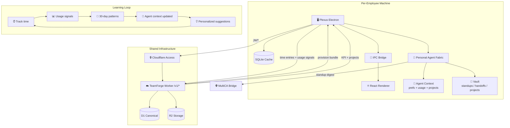

<div align="center">


</div>

<p align="center">
  
</p>

<p align="center">
  
  
  
  
</p>

<p align="center">
  
</p>

---

> **Plexus** is the native agent cockpit for Thoughtseed employees. Each person gets a **personal agent fabric** — synthesized from the Krebs-cycle model, adapted to their role and projects, and continuously learning from real work patterns. Track time, run agents, get standup KPIs, and let the system evolve around you — all with **zero device secrets** and **email-only login**.
>
> Plexus is not a port of the founder's Paperclip setup. It is a **synthesis platform**: the organizational agent model (departments, coordination, vault-based handoffs) provides the template, but every employee's instance personalizes through provisioning, preference capture, and a usage-learning loop that adapts agent context, skills, and suggestions over time.


## ✨ Features

<table>
<tr>
<td width="50%" valign="top">

### ⏱ One-Click Timer
Start, stop, and switch between projects instantly. Running timers persist across app restarts.

</td>
<td width="50%" valign="top">

### 📁 Project Workspace
Color-coded projects synced from TeamForge, enriched with vault context — decisions, handoffs, and active work from R2 storage.

</td>
</tr>
<tr>
<td width="50%" valign="top">

### 🤖 Personal Agent Fabric
Your own Krebs-cycle agent team — synthesized at provisioning, adapted to your role and projects. Live health, per-agent skills, and bridge reachability. Not a clone of the founder's setup; each instance is shaped by what *you* work on.

</td>
<td width="50%" valign="top">

### 📊 Standup + KPI
Auto-generated daily standup from your tracked time — yesterday, today, blockers, hours, compliance status.

</td>
</tr>
<tr>
<td width="50%" valign="top">

### ⚙️ Preferences
Set focus areas, working hours, CEO referral, comms prefs. Saved to the cloud and synced into your agent context.

</td>
<td width="50%" valign="top">

### 🔮 Auto-Learning Loop
Agents evolve from your real usage. 30-day activity patterns (projects, focus blocks, time cadence) feed back into agent context, generating personalized suggestions, adjusting skill priorities, and surfacing burnout risk — without manual configuration.

</td>
</tr>
</table>


## 🚀 Quick Start

```bash
git clone https://github.com/Sheshiyer/plexus-ts.git
cd plexus-ts
npm install
npm run dev
```

**Build for production:**

```bash
npm run build
```


## 🏗 Architecture

### Synthesis, not a port

Plexus does **not** clone or fork `thoughtseed-paperclip`. The founder's Paperclip instance is a single-tenant reference implementation — 6 hardcoded agents, the founder's specific models, and a vault structure tuned to one person's workflow.

Plexus extracts the **organizational patterns** (Krebs-cycle departments, vault-based coordination, standup loops, MultiCA bridge protocol) and makes them available as a **parameterized, learning platform** where each employee gets their own agent fabric that:

1. **Provisions** from the TeamForge Worker — role, projects, workspace context arrive at login
2. **Customizes** through preferences — focus areas, working hours, comms style shape agent behavior
3. **Learns** from real usage — tracked time, project switches, focus blocks, standup compliance feed back into agent context every cycle
4. **Evolves** autonomously — weekly self-evolution generates new suggestions, adjusts skill priorities, and surfaces patterns the employee hasn't explicitly configured



### What each employee gets vs. what the founder has

| Dimension | Founder (thoughtseed-paperclip) | Employee (Plexus) |
|-----------|--------------------------------|-------------------|
| **Agents** | Fixed 6 Krebs agents, founder-tuned | Synthesized from the same model, adapted to employee role and active projects |
| **Models** | Founder's model choices (kimi-k2.6, qwen3-coder, etc.) | Selected per employee needs; can differ by role |
| **Skills** | Founder's full skill routing map | Per-agent skills scoped to employee's project set and department |
| **Vault** | Founder's vault with all project data | Employee-scoped vault, enriched with project context from R2 |
| **Config source** | Local `.env` + `manifest.yaml` | Worker-provisioned after email login — zero device secrets |
| **Learning** | Weekly self-evolution on founder's patterns | Continuous auto-learning from each employee's tracked time, focus, and cadence |
| **Standup** | CEO aggregates, Hermes dispatches (cron) | Per-employee standup from D1 canonical time data; agent surfaces it |
| **Tasks** | Huly integration (founder-managed) | TeamForge feed sync surfaces tasks; agents route by Krebs stage |

### Zero-Secrets Model

All configuration and credentials flow from the TeamForge Worker after Cloudflare Access login. Nothing sensitive is stored on the device.

| Layer | Responsibility | Auth |
|-------|---------------|------|
| **Cloudflare Access** | OTP email login, JWT issuance | Team app / Operators app |
| **TeamForge Worker** | Member provisioning, KPI, preferences, time entries, project data | CF Access JWT |
| **Plexus (Electron)** | Local SQLite cache, timer, UI, agent fabric, usage signal capture | Receives JWT from Access |
| **Personal Agent Fabric** | Per-member agents, standup generation, context sync, learning loop | Local runtime, Worker-provisioned config |
| **R2 + D1** | Canonical project data, time entries, vault artifacts, OTA releases | Worker-mediated |

Security: `contextIsolation: true`, `nodeIntegration: false`, `sandbox: true`.

### The Learning Loop

```
Employee works → Plexus captures usage signals (project, duration, focus blocks, cadence)
    → Signals accumulate in D1 via Worker
    → usage-evolution.sh aggregates 30-day patterns
    → Agent CONTEXT.md updated with insights + suggestions
    → Agents adapt behavior (standup focus, task routing priority, skill weighting)
    → Employee sees personalized suggestions in next session
    → Cycle repeats — no manual tuning required
```

This is the core differentiator: the agent fabric isn't static infrastructure. It's a **living system that gets better at serving each employee** through their actual work, not through configuration.


## 📂 Project Structure

```
plexus-ts/
├── src/
│   ├── main/              # Electron main process
│   │   ├── main.ts        # IPC handlers, auth, timer logic
│   │   ├── fabric.ts      # Agent fabric health + standup reader
│   │   ├── teamforge.ts   # Worker API client, member provisioning
│   │   └── db.ts          # SQLite schema & queries
│   ├── preload/           # contextBridge preload script
│   ├── renderer/          # React UI (Vite)
│   │   ├── components/
│   │   │   ├── Timer.tsx
│   │   │   ├── AgentFabricPanel.tsx   # 🤖 Agent health + standup
│   │   │   ├── PreferencesPanel.tsx   # ⚙️ Member preferences
│   │   │   └── ...
│   │   └── App.tsx
│   ├── shared/
│   │   └── types.ts       # Shared TypeScript contracts
│   └── db/                # SQLite migrations
├── dist/                  # Compiled output
├── assets/                # Icons, banner, logo
├── package.json
└── README.md
```


## 🔌 Integrations

### Personal Agent Fabric (synthesized from Krebs-cycle model)
Each employee's Plexus provisions a **personal agent fabric** — not a copy of the founder's agents, but a synthesis adapted to their role, projects, and evolving work patterns. The Krebs-cycle departmental model (science → engineering → design → synthesis → communications, with CEO coordination) provides the organizational template. Agent context, skills, and vault structure are personalized through:

- **Provisioning** — Worker returns the employee's project set, role, workspace, and feature flags
- **Preferences** — focus areas, working hours, and comms style flow into agent context
- **Usage learning** — 30-day tracked-time patterns continuously reshape agent behavior
- **Standup loop** — daily standup agent reads from D1 canonical time data, writes to vault, Hermes dispatches via MultiCA bridge
- **Task routing** — TeamForge feed sync surfaces tasks; agents route them by Krebs stage and project tags

### TeamForge Control Plane
Cloudflare Worker at `plexus-api.thoughtseed.space` is the canonical source for all member data — time entries, KPIs, preferences, project data, and R2 vault artifacts. The Worker also brokers Cloudflare Realtime SFU sessions for live media. No device secrets required.

### MultiCA Bridge
Bidirectional bridge to the cofounder platform. Upstream: standup digests, weekly member reports, heartbeat events. Downstream: founder directives and task assignments. Each employee's agent fabric connects independently — the founder sees an aggregated view.

### Cloudflare Access
Email-only OTP login. Zero passwords. Zero tokens stored locally. The `CF_Authorization` cookie is issued by Access and validated by the Worker.

### Cloudflare Realtime (SFU)
WebRTC media transport for team video/audio/screen-share. Worker brokers all SFU API calls — clients never hold Cloudflare secrets. Room state, participants, and meeting records live in D1.


## 📜 Changelog

See [CHANGELOG.md](CHANGELOG.md) for version history.

### v0.3.2 — Agent Fabric Enrichment (2026-06-16)

- 🧩 Paperclip install detection + dynamic port discovery
- 🏢 Org config, agent-skill, and task-feed panels from the local fabric
- 🗂 Per-project vault detail wired into Projects
- 🩹 Hardened onboarding / KPI / vault fetches (error surfacing + auto-refresh)
- 🧹 Removed dead `PlexusViz` component

### v0.3.1 — Permissions + WebRTC (2026-06-16)

- 🎙 macOS media entitlements (mic + camera) for packaged builds
- 📡 WebRTC session manager for Cloudflare Realtime SFU
- 🔐 Onboarding permissions panel with auto-request
- 🖥 Screen recording settings launcher

### v0.3.0 — Realtime Workspace (2026-06-15)

- 🎥 Realtime tab with room lobby, audio/video controls, multi-screen-share
- 📞 Meeting records linked to projects and time entries
- 🔄 OTA update proven end-to-end (0.2.0 → 0.3.0)

### v0.2.0 — Agent Fabric Release (2026-06-12)

- 🤖 Agent Fabric Panel with live health tiles
- 📊 Auto-generated standup + KPI from canonical D1
- ⚙️ Preferences UI synced to agent context
- 🔮 Usage-learning insights + agent suggestions
- 🔒 Zero-device-secrets architecture via Cloudflare Access
- 🧹 Legacy bridge fully retired


## 🛡 Security

- Renderer is **untrusted** — no Node access
- All IPC payloads validated in main process
- SQLite WAL mode for atomic writes
- Settings stored in `~/.plexus/plexus.db`
- No remote content loaded with Node privileges
- **Zero secrets**: all auth flows through Cloudflare Access; credentials never stored on disk


## 📜 License

MIT © Thoughtseed

<div align="center">


**Built with ❤️ by Thoughtseed**

</div>
