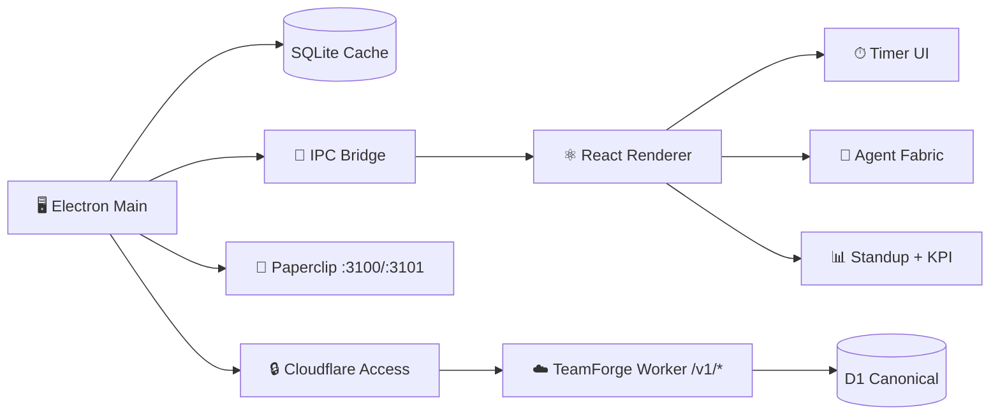

<div align="center">


</div>

<p align="center">
  
</p>

<p align="center">
  
  
  
  
</p>

<p align="center">
  
</p>

---

> **Plexus** is the native agent cockpit for Thoughtseed employees. Track time, run your personal Paperclip agent fabric, get daily standup KPIs, and let your agents learn from your real work patterns — all with **zero device secrets** and **email-only login**.


## ✨ Features

<table>
<tr>
<td width="50%" valign="top">

### ⏱ One-Click Timer
Start, stop, and switch between projects instantly. Running timers persist across app restarts.

</td>
<td width="50%" valign="top">

### 📁 Project Management
Color-coded projects with client names and hourly rates.

</td>
</tr>
<tr>
<td width="50%" valign="top">

### 🤖 Agent Fabric Panel
Live health dashboard for your 6 Paperclip agents (`ceo`, `scientist`, `engineer`, `designer`, `synthesist`, `hermes`), port status, and bridge reachability.

</td>
<td width="50%" valign="top">

### 📊 Standup + KPI
Auto-generated daily standup from your tracked time — yesterday, today, blockers, hours, compliance status.

</td>
</tr>
<tr>
<td width="50%" valign="top">

### ⚙️ Preferences
Set focus areas, working hours, CEO referral, comms prefs. Saved to the cloud and synced into your agent context.

</td>
<td width="50%" valign="top">

### 🔮 Usage Learning
Monthly agent suggestions based on 30-day activity patterns — focus blocks, burnout risk, compliance trends.

</td>
</tr>
</table>


## 🚀 Quick Start

```bash
git clone https://github.com/Sheshiyer/plexus-ts.git
cd plexus-ts
npm install
npm run dev
```

**Build for production:**

```bash
npm run build
```


## 🏗 Architecture



### Zero-Secrets Model

All configuration and credentials flow from the TeamForge Worker after Cloudflare Access login. Nothing sensitive is stored on the device.

| Layer | Responsibility | Auth |
|-------|---------------|------|
| **Cloudflare Access** | OTP email login, JWT issuance | Team app / Operators app |
| **TeamForge Worker** | Member provisioning, KPI, preferences, time entries | CF Access JWT / app-bearer |
| **Plexus (Electron)** | Local SQLite cache, timer, UI, agent fabric panel | Receives JWT from Access |
| **Paperclip (:3100/:3101)** | Per-member agent runtime, standups, context sync | Local runtime |

Security: `contextIsolation: true`, `nodeIntegration: false`, `sandbox: true`.


## 📂 Project Structure

```
plexus-ts/
├── src/
│   ├── main/              # Electron main process
│   │   ├── main.ts        # IPC handlers, auth, timer logic
│   │   ├── fabric.ts      # Agent fabric health + standup reader
│   │   ├── teamforge.ts   # Worker API client, member provisioning
│   │   └── db.ts          # SQLite schema & queries
│   ├── preload/           # contextBridge preload script
│   ├── renderer/          # React UI (Vite)
│   │   ├── components/
│   │   │   ├── Timer.tsx
│   │   │   ├── AgentFabricPanel.tsx   # 🤖 Agent health + standup
│   │   │   ├── PreferencesPanel.tsx   # ⚙️ Member preferences
│   │   │   └── ...
│   │   └── App.tsx
│   ├── shared/
│   │   └── types.ts       # Shared TypeScript contracts
│   └── db/                # SQLite migrations
├── dist/                  # Compiled output
├── assets/                # Icons, banner, logo
├── package.json
└── README.md
```


## 🔌 Integrations

### Paperclip Agent Fabric
Each employee gets their own reskinned Paperclip runtime with 6 agents. Daily standups are auto-generated into `vault/standups/` so agents can read member work. Preferences sync into `agents/ceo/CONTEXT.md` for agent context.

### TeamForge Control Plane
Cloudflare Worker at `plexus-api.thoughtseed.space` serves as the canonical source for all member data — time entries, KPIs, preferences. No device secrets required.

### Cloudflare Access
Email-only OTP login. Zero passwords. Zero tokens stored locally. The `CF_Authorization` cookie is issued by Access and validated by the Worker.


## 📜 Changelog

See [CHANGELOG.md](CHANGELOG.md) for version history.

### v0.2.0 — Agent Fabric Release (2026-06-12)

- 🤖 Agent Fabric Panel with live health tiles for 6 agents
- 📊 Auto-generated standup + KPI from canonical D1
- ⚙️ Preferences UI synced to agent context
- 🔮 Monthly usage-learning insights + agent suggestions
- 🔒 Zero-device-secrets architecture via Cloudflare Access
- 🧹 Legacy bridge fully retired


## 🛡 Security

- Renderer is **untrusted** — no Node access
- All IPC payloads validated in main process
- SQLite WAL mode for atomic writes
- Settings stored in `~/.plexus/plexus.db`
- No remote content loaded with Node privileges
- **Zero secrets**: all auth flows through Cloudflare Access; credentials never stored on disk


## 📜 License

MIT © Thoughtseed

<div align="center">


**Built with ❤️ by Thoughtseed**

</div>
