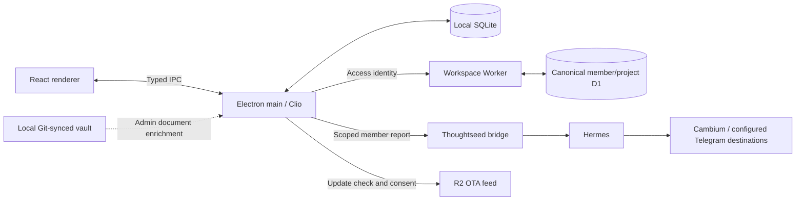

<div align="center">


</div>

<p align="center">
  
</p>

<p align="center">
  
  
  
  
</p>

<p align="center">
  
</p>

---

**Plexus** is Thoughtseed's native work coordination app. Employees track work against verified projects, review work records, use Clio, and send member-scoped evidence through the Thoughtseed bridge to Hermes. Electron main owns model calls, permissions, and encrypted credential custody; React receives typed IPC results.

## Current status

Source baseline: **v0.7.12**, merged `e8d3a74`. The September 5 migration review confirms that the Workspace API uses Thoughtseed Labs Access, while the public OTA feed used by v0.7.9–v0.7.12 still belongs to the personal Cloudflare account. Completing the Labs migration remains open; a working API or public manifest does not prove an installed upgrade.

Start with the [documentation map](docs/DOCUMENTATION_MAP.md), [planning state](.planning/STATE.md), [acceptance ledger](ISA.md), and [migration evidence](docs/evidence/2026-09-05-labs-migration-review.md). The [changelog](CHANGELOG.md) records shipped version history.

## What the app does

- **Focus and work records:** start, pause, and close sessions against GitHub-backed projects; local SQLite preserves recovery state and proof references.
- **Projects:** synchronize canonical Worker/D1 project mappings. Administrators can review matching briefs from a local Git-synced founder vault; briefs cannot create or change project identities.
- **Clio:** assemble bounded work context, group local AI sessions, stream assistant responses, and request confirmation before write-capable actions.
- **Reporting:** queue daily evidence locally, send through the member bridge to Hermes, and keep degraded fallback/retry state visible. A Workspace Worker fallback is not a Hermes delivery receipt.
- **Co-working:** show presence, rooms, and media controls. End-to-end SFU acceptance requires current two-client evidence; UI or deterministic tests alone do not establish it.
- **Settings:** manage member preferences, GitHub verification, assistant settings, and consent-based updates.

Paperclip and the dedicated Fabric helper UI/runtime are retired. There is no Paperclip installation or repair step in current Plexus onboarding. Compatibility names and legacy readers remain in source; see [retired helpers](docs/optional-helpers.md).

## Develop locally

```bash
git clone https://github.com/Sheshiyer/plexus-ts.git
cd plexus-ts
npm ci
npm run dev
```

Use Node.js 22, matching CI. `npm run dev` starts Vite on `127.0.0.1:5173` and Electron. Cloud-backed features require their corresponding authenticated services; local development does not establish production acceptance.

```bash
npm run typecheck
npm run lint
npm run test:all
npm run build:renderer
```

For an unsigned macOS arm64 packaging check, use `npm run release:dry-run`. It does not publish a release or establish signing/notarization proof. Read [Apple signing](docs/APPLE_SIGNING.md) and [OTA release operations](docs/OTA_RELEASE.md) before preparing distribution artifacts.

## Architecture and authority


```mermaid
flowchart LR
  UI[React renderer] <-->|Typed IPC| Main[Electron main / Clio]
  Main <--> Local[(Local SQLite)]
  Main -->|Access identity| Worker[Workspace Worker]
  Worker <--> D1[(Canonical member/project D1)]
  Main -->|Scoped member report| Bridge[Thoughtseed bridge]
  Bridge --> Hermes[Hermes]
  Hermes --> Founder[Cambium / configured Telegram destinations]
  Vault[Local Git-synced vault] -. Admin document enrichment .-> Main
  Main -->|Update check and consent| OTA[R2 OTA feed]
```

| Surface | Responsibility | Authority boundary |
|---|---|---|
| Electron main | Clio context/model calls, action confirmation, local outbox, secure storage | Renderer cannot retrieve infrastructure credentials |
| Workspace Worker / D1 | Identity, authorization, project/client mappings, preferences, work and realtime state | `plexus-api.thoughtseed.space`; Labs Access and Worker verification |
| Thoughtseed bridge / Hermes | Member reporting transport, aggregation, routing | Only scoped member bridge tokens enter Plexus; no admin `BRIDGE_TOKEN` or Telegram bot credentials |
| Founder vault | Local document enrichment | Admin-only and matched to canonical Worker project IDs |
| R2 OTA | Signed release artifacts and update metadata | Publication workflow authority; separate from project identity and document enrichment |

Daily events may use the Workspace Worker only after bridge failure and remain eligible for bridge retry. Monthly reviews retain a retryable bridge handoff. Hermes maps routing intent such as `audience: founder_review` to destinations. Local queueing, bridge acceptance, Hermes processing, and founder-visible delivery are separate proof levels. See the [Hermes reporting contract](docs/architecture/HERMES_REPORTING_CONTRACT.md).

The historical filename `src/main/teamforge.ts` is the current Workspace Worker client. Worker source remains in the sibling `team-forge-ts/cloudflare/worker`; Labs operations use its explicit `wrangler.labs.jsonc` and the `thoughtseed-labs` profile. The retained personal `wrangler.jsonc` is not the production config.

## Source map

```text
src/main/main.ts                 Electron lifecycle and IPC
src/main/assistant-runtime.ts    Native assistant runtime
src/main/assistant-context.ts    Bounded context assembly
src/main/assistant-tools.ts      Tool intents and execution boundaries
src/main/assistant-daily.ts      Daily event queue and delivery
src/main/thoughtseed-bridge.ts   Member bridge and task compatibility
src/main/teamforge.ts           Workspace Worker client and Access login
src/main/vault-projects.ts      Admin document enrichment
src/main/updates.ts             Pinned feed and update consent state
src/preload/preload.ts          Typed renderer bridge
src/renderer/App.tsx            React app shell
src/db/database.ts              Local SQLite data and migrations
src/shared/                     Shared contracts
```

## Installation and release proof

The supported signed OTA lane is **macOS arm64**. Windows/Linux packaging configuration is not evidence of signed feeds for those platforms. Founder GitHub onboarding uses the packaged [guarded setup helper](docs/GITHUB_FOUNDER_SETUP.md); GitHub CLI login alone does not grant the app repository authority.

The current runtime feed is `https://pub-a25dc91980924ba09b031c07d6812e53.r2.dev/plexus`. Older v0.7.8-and-earlier cohorts use `plexus-upgrade.thoughtseed.space`, whose migration recovery is still open. Preserve both installed-client paths during a bridge release; changing a GitHub R2 secret alone cannot move already installed clients. See the [migration evidence](docs/evidence/2026-09-05-labs-migration-review.md).

Use [docs/RELEASE_EVIDENCE.md](docs/RELEASE_EVIDENCE.md) for production claims:

```bash
npm run verify:all
npm run verify:release-candidate
```

These are local gates, not publication or installed-app receipts. Signed OTA requires the secret-free Release Candidate workflow, protected Publish OTA workflow, artifact-byte checks, and installed upgrade/relaunch proof with separate download/install consent.

The [July 10 closeout packet](docs/evidence/2026-07-10-release-candidate-closeout/README.md) remains a historical input to `npm run verify:release-candidate`; its old recommendation is not the current migration verdict. Current boundaries are tracked in [the deferred register](docs/DEFERRED_REGISTER.md) and [release recommendation](docs/RELEASE_CANDIDATE_RECOMMENDATION.md).
