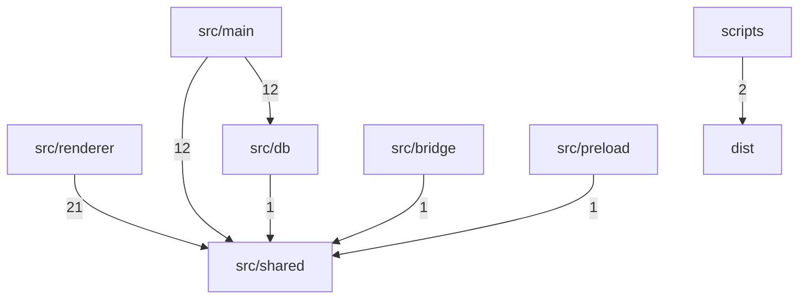

# Dependency Graph

> Auto-generated by `ArchitectureAssetsSync.hook.ts`. Last refreshed: 2026-06-25T09:25:09.414Z
> Scanned 63 source files. Edges aggregate to top-level directories (or `src/<name>`).

## Module graph

## Edge counts

| From | To | Imports |
|---|---|---|
| `src/renderer` | `src/shared` | 21 |
| `src/main` | `src/shared` | 12 |
| `src/main` | `src/db` | 12 |
| `scripts` | `dist` | 2 |
| `src/bridge` | `src/shared` | 1 |
| `src/db` | `src/shared` | 1 |
| `src/preload` | `src/shared` | 1 |