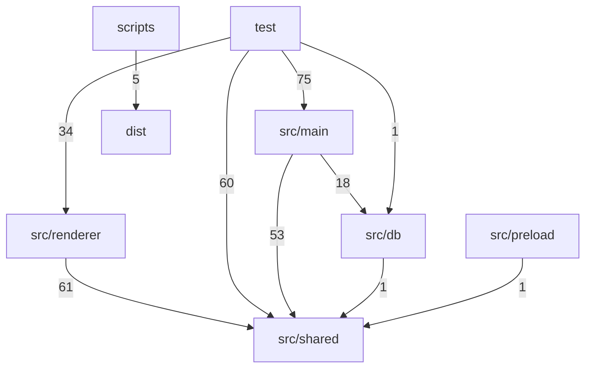

# Dependency Graph

> Generated by the source-owned `DependencyGraphScanner.ts`, invoked directly on 2026-09-05; the hook itself did not run. Scan timestamp: 2026-09-05T11:38:28.072Z
> Scanned 349 source files. Edges aggregate to top-level directories (or `src/<name>`).

## Scope and limitations

This scan contains **349** `.ts`, `.tsx`, `.js`, `.jsx`, `.mjs` and `.cjs`
files in the isolated v0.7.12/migration checkout, including tests and scripts.
It skips hidden and common build/vendor directories. Counts are relative
static `import`/`require` matches aggregated across directory boundaries, not
unique symbol dependencies or runtime calls. Dynamic imports, same-bucket edges
and external package imports are omitted; a target need not exist for a text
match to count. The `scripts → dist` edge therefore does not prove a build exists.

Reproduce using the owning scanner shown in [asset maintenance](REFRESH-NEEDED.md).
For service responsibilities and runtime acceptance, use [the authored runtime
map](RUNTIME_MAP.md) and [service inventory](SERVICES.md). The old 143-file July
snapshot has been replaced by this fresh source scan; no runtime tests or
service probes are represented by the graph.

## Module graph

```mermaid
graph TD
  test["test"] -->|75| src_main["src/main"]
  src_renderer["src/renderer"] -->|61| src_shared["src/shared"]
  test["test"] -->|60| src_shared["src/shared"]
  src_main["src/main"] -->|53| src_shared["src/shared"]
  test["test"] -->|34| src_renderer["src/renderer"]
  src_main["src/main"] -->|18| src_db["src/db"]
  scripts["scripts"] -->|5| dist["dist"]
  test["test"] -->|1| src_db["src/db"]
  src_db["src/db"] -->|1| src_shared["src/shared"]
  src_preload["src/preload"] -->|1| src_shared["src/shared"]
```

## Edge counts

| From | To | Imports |
|---|---|---|
| `test` | `src/main` | 75 |
| `src/renderer` | `src/shared` | 61 |
| `test` | `src/shared` | 60 |
| `src/main` | `src/shared` | 53 |
| `test` | `src/renderer` | 34 |
| `src/main` | `src/db` | 18 |
| `scripts` | `dist` | 5 |
| `test` | `src/db` | 1 |
| `src/db` | `src/shared` | 1 |
| `src/preload` | `src/shared` | 1 |
