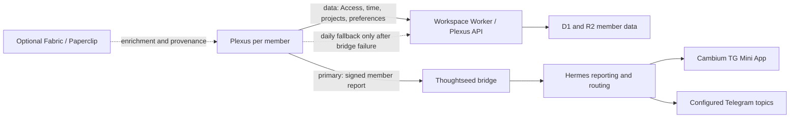

# Plexus to Hermes Reporting Contract

**Status:** Current authority  
**Effective:** 2026-07-10  
**Scope:** Plexus member reporting, founder review, nudges, and optional helper boundaries

This contract replaces active Plexus guidance that names MultiCA or TeamForge as
the reporting destination or founder console. Those names may remain in dated
history and compatibility provenance, but they are not part of the current
reporting architecture.

## Authority Boundary

Plexus is installed **locally per member**. Its Electron main process owns the
member's bounded local context, assistant runtime, report preparation, local
queue, and member-scoped bridge-token custody.

The remote responsibilities are intentionally split:

| Plane | Authority |
| --- | --- |
| Member data plane | Workspace Worker / Plexus API: Access identity, provisioning, projects, time entries, KPI reads, preferences, D1/R2 records, and realtime workspace state |
| Reporting plane | Member-scoped Thoughtseed bridge, which is Plexus's primary reporting port to Hermes |
| Orchestration | Hermes: report routines, retries after receipt, aggregation, routing policy, and Telegram topic mapping |
| Founder read and decision plane | Cambium Telegram Mini App plus the Telegram topics configured by Hermes/Cambium |
| Local enrichment | Fabric/Paperclip, when enabled; never an authority or required transport |

The Workspace Worker is still canonical for member data. It is not the founder
reporting console and does not replace Hermes orchestration.

Plexus sends routing intent such as `audience: founder_review`. It must not
encode Telegram chat IDs or topic IDs. Hermes/Cambium configuration owns those
identifiers and may change them without a Plexus release.

## KPI and Standup Semantics

The member KPI core is deliberately small:

- today's recorded work time;
- the current week's recorded work time; and
- standup compliance for the same explicit UTC date.

Project mix may enrich a report with context, but it is not a separate employee
score and must not become a surveillance metric. A member is standup-compliant
for a UTC date only when persisted standup evidence exists for that same UTC
date. A synthetic identifier or a long focus session is not standup evidence.

Monthly compliance uses distinct UTC dates that contain recorded work as its
denominator. It reports compliant work dates, missing work dates, and the
resulting ratio. It does not assume weekdays on which no work was recorded.

Standup compliance has two consumers:

1. the existing Plexus suggestion/nudge path proactively surfaces a missing
   standup during the member's day; and
2. each generated monthly Hermes founder-review report includes the monthly
   compliance summary. Scheduling of the month-close routine remains Hermes
   infrastructure ownership; this Plexus slice provides the member-scoped
   bridge payload and retry handoff when the review is requested.

## Preferences and Visibility

Preferences are member data in the Workspace Worker. The current monthly review
payload includes no preference fields; if preference-derived fields are added,
they must respect the member's `weeklyVisibility` setting. Plexus must never
copy the full preferences object into a founder report by default.

## Delivery and Idempotency

1. Plexus creates a stable daily-event or review identifier before delivery.
2. The member-scoped Thoughtseed bridge sends that identifier as the bridge
   message ID to Hermes.
3. A successful bridge response is the primary success path. Plexus must not
   also send the same report through the Workspace Worker.
4. Daily assistant events may use the Workspace Worker report route only after
   the bridge returns a non-success response or throws. Monthly reviews do not
   fall back to the Worker; they retain a retryable bridge handoff.
5. A successful daily fallback records degraded transport observability and
   leaves the item eligible for bridge retry. Fallback is not evidence of Hermes
   receipt.
6. Reusing the stable message ID gives the receiver a deterministic idempotency
   key. Receiver-side deduplication remains an external Hermes/Cambium proof
   boundary and is not claimed by local tests.

Local queued, failed, fallback-delivered, bridge-delivered, and retried states
must remain distinguishable. Deterministic local smoke is not live Hermes or
Telegram delivery proof.

## Token Custody

- The renderer never receives bridge bearer tokens, Worker bearer tokens, or
  Telegram identifiers.
- Plexus stores only a scoped per-member bridge token in Electron main-process
  secure custody.
- Plexus pins bridge traffic to `https://curious.thoughtseed.space`; a controlled
  development endpoint can be supplied only through the process-owned
  `PLEXUS_THOUGHTSEED_BRIDGE_URL` override. Renderer or redeem-response data
  cannot redirect future reporting.
- Plexus must never store the infrastructure-wide Worker admin `BRIDGE_TOKEN`.
- Workspace Worker credentials remain Access-backed and server-mediated.
- Telegram bot tokens and topic configuration remain in Hermes/Cambium
  infrastructure, never Plexus Settings.

## Deprecated and Optional Components

| Component | Current status |
| --- | --- |
| MultiCA | Deprecated. No endpoint, token, provision contract, setting, route, or report sink may be required by Plexus. Legacy provision payloads may contain an extra `multica` field; Plexus ignores it. |
| TeamForge | Deprecated as an application/reporting authority. Dated repo names, deployed resource names, and `src/main/teamforge.ts` may remain as compatibility provenance for the Workspace Worker data-plane client. |
| Fabric | Optional local helper for diagnostics, enrichment, or task provenance; never a required reporting hop. |
| Paperclip | Optional local helper/reference implementation; never the employee runtime center, founder console, or canonical report destination. |

## Anti-Criteria

The contract is violated if Plexus:

- requires a MultiCA or TeamForge endpoint/workspace to submit a report;
- treats a TeamForge console or local Plexus cockpit as the canonical remote
  founder surface;
- hardcodes a Telegram chat or topic ID;
- treats an inferred timer duration as standup compliance;
- calls the Workspace Worker when the primary bridge send succeeded;
- drops a fallback-delivered item before Hermes receipt can be retried;
- exposes infrastructure or member bridge credentials to the renderer; or
- makes Fabric/Paperclip availability a prerequisite for time tracking,
  reports, standups, nudges, or founder review.

## Historical Documentation Policy

Do not rewrite dated evidence as if it never happened. MultiCA/TeamForge names
may remain in `CHANGELOG`, `MEMORY/WORK`, `REVIEW`, `docs/evidence`, and
`docs/RELEASE_0.2.0` where they describe an earlier state. Current README,
roadmap, handoff, and architecture contracts must point here instead.
