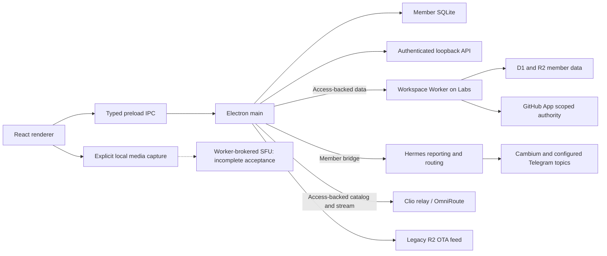

# Plexus runtime architecture

Source review: 2026-09-05. Application version: **0.7.12**. This authored map is
separate from the host-generated inventories. It describes checked-in source
and links to dated live evidence; it does not certify deployment or current
credentials. See [documentation map](../DOCUMENTATION_MAP.md).

## Ownership and request paths

| Boundary | Source owner | Operating contract |
| --- | --- | --- |
| Renderer and navigation | `src/renderer/App.tsx`, components and `routePolicy.ts` | Member workflow UI; no infrastructure credentials |
| IPC authority | `src/preload/preload.ts`, `src/main/main.ts`, `ipc-security.ts` | Allowlisted sender and payload validation before privileged handlers |
| Local persistence | `src/db/database.ts` | Work records, settings, intents, audits, reports, outboxes and compatibility data |
| Native assistant | `assistant-runtime.ts`, `assistant-tools.ts`, `assistant-models.ts` | Bounded read-only model tools; confirmed writes through persisted intents |
| Relay access | `assistant-omniroute.ts`, Access fetch in `main.ts` | Production Clio origin is baked into packaged source; relay credentials are not desktop provider keys |
| Reporting | `assistant-daily.ts`, `review-cycle.ts`, `thoughtseed-bridge.ts` | Bridge-first daily events; monthly reviews remain bridge-only with durable retries |
| Realtime | `useRealtimeMedia.ts`, `RealtimeSession.ts`, Worker realtime routes | Explicit capture and typed room metadata; SDP scaffolding does not establish media delivery |
| Updater | `src/main/updates.ts`, `package.json`, release workflows | Separate discovery/download/restart consent and protected publication |

Paths abbreviated in the table belong to `src/main` unless another directory is
shown. The loopback API is an authenticated native integration surface; it is
not a replacement for the remote Workspace Worker.

## Account migration is split by service

The September [migration receipt](../evidence/2026-09-05-labs-migration-review.md)
records Labs API/Access reachability and configuration. Installed v0.7.9–v0.7.12
still read the personal account's `pub-a25dc91980924ba09b031c07d6812e53.r2.dev`
feed. Earlier installed clients read the custom upgrade hostname. The remote
Labs manifest was 0.7.8 while the active legacy manifest was 0.7.12.

Those observations require a retained bridge-update path for both client
cohorts. API relocation is not OTA migration completion. Follow [the OTA
runbook](../OTA_RELEASE.md) for exact object parity, hostname acceptance,
publication and installed-upgrade gates.

## Server snapshot scope

The sibling Worker directory was inspected for configuration and source shape;
it is not a Git checkout with a verified deployed revision. Its handlers reveal
specific gaps to reconcile, not proof that the current live Worker executes that
same code. Compare deployed version and canonical server source before patching
or deploying from that directory.

## Retired names and unresolved source contracts

Paperclip/local agent Fabric and Huly are not active Plexus services. Historical
resource/repository names and compatibility fields remain; Hermes owns reporting
and downstream routing. See [reporting authority](HERMES_REPORTING_CONTRACT.md).

- The closeout checkbox says Hermes/Telegram delivery, while the inspected
  Worker closeout handler persists a queued compatibility payload. A queued
  meeting is not a channel receipt; a delivery implementation and live receipt
  must establish the stronger claim.
- `daily.sendEvent` has an executor, but the capability catalog labels it
  `declared_only`. Reconcile that source contract before using catalog status as
  the sole availability decision.
- Preload declares recording start/stop/finalize methods without matching
  main-process handlers in this source. The recording manifest API remains a
  proposal, not an implemented capture/upload path.
- Client peer connections exist; the inspected Worker track route returns
  metadata acknowledgement without provider negotiation. Complete the SFU
  broker and two-client acceptance under issue #26.

The [dependency graph](DEPENDENCY-GRAPH.md) counts syntactic imports, including
tests and scripts. It cannot establish any of these runtime behaviors.
