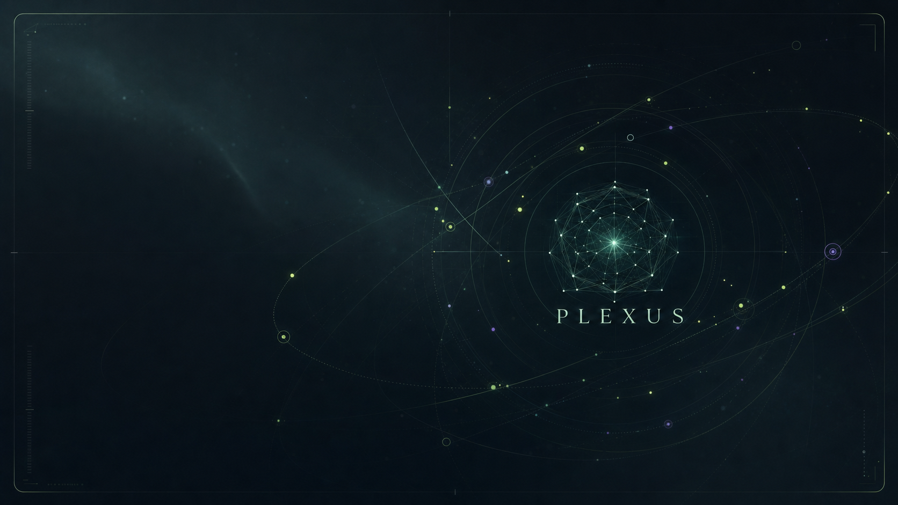
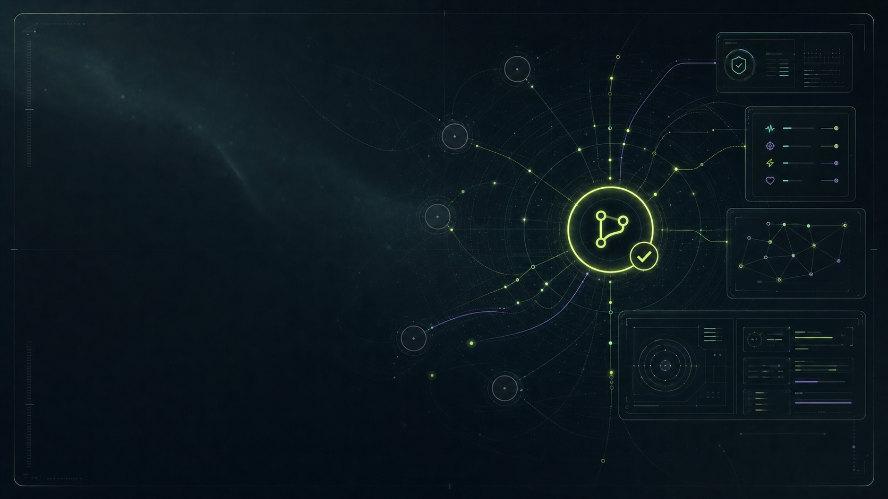
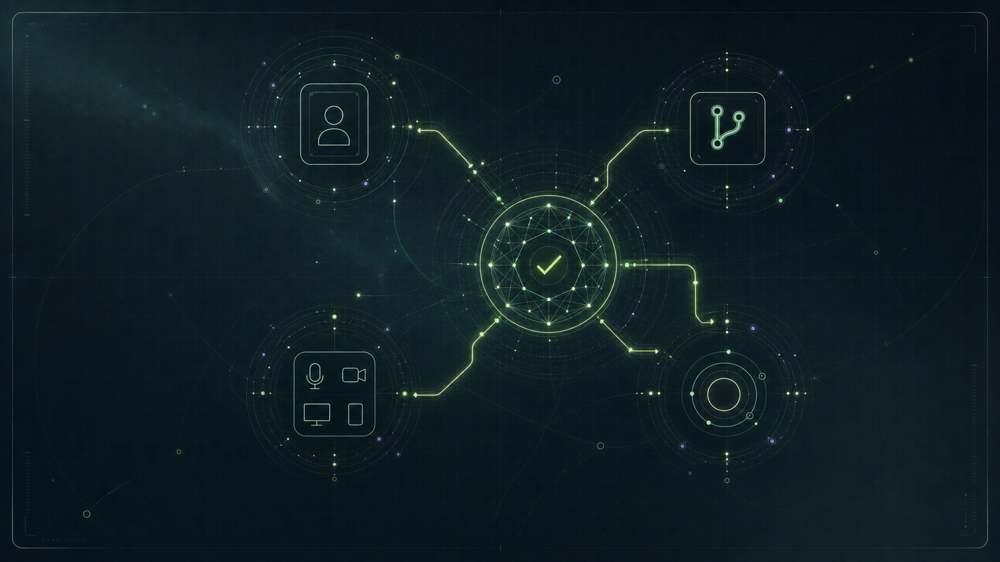

# Plexus Onboarding Moodboard

Date: 2026-06-19
Generator: `codex-gpt-image` skill via Codex OAuth
Model: `gpt-image-2`
Image size: `1536x1024`

## Intent

The current Onboarding page should become a guided first-run experience: a calm operational entry sequence into Plexus as the Thoughtseed Work Coordination Layer. The moodboard direction is **Operational Muse**: a living Higgs-field of seed particles, FORMA/Cambium precision panels, evidence-backed work setup, optional private rhythm support, and a final readiness state.

This is not a fake product screenshot set. These images are visual anchors for motion, tone, scene composition, and future UI build decisions.

## Visual Frames

### 01 - Entry Higgs Field



Use for the opening onboarding scene: Plexus as a living coordination field. The member should feel they are entering an operating environment, not reading a checklist.

Product translation:
- Full-bleed animated particle field behind a restrained onboarding panel.
- Central seed/Plexus core becomes the progress anchor.
- The first copy should say what Plexus is and what setup will unlock.

Motion translation:
- Seed particles orbit slowly.
- The central field breathes with transform/opacity only.
- Reduced-motion mode swaps the loop for a still frame.

### 02 - GitHub Proof Graph



Use for repo-backed project setup. This step should explain the rule clearly: new work records require a verified GitHub-backed project, while legacy work remains readable.

Product translation:
- Project cards connect into a repo/evidence graph.
- Verified repos glow chartreuse; unverified project nodes stay muted and actionable.
- The CTA should be `Add repo` / `Verify repo`, not a generic continue button.

Motion translation:
- Repo nodes activate one at a time after verification.
- Evidence lines draw from repo to work/session records.
- Failed verification shakes lightly and becomes a retryable handoff, not a dead end.

### 03 - Rhythm Breakwork


Use for optional biorhythmic clock and breakwork setup. This must feel private, opt-in, and humane.

Product translation:
- Birthdate lives in a private local rhythm panel, separate from CEO-visible preferences.
- Voice and sound settings are optional and deletable.
- Copy must avoid medical claims and explain that ElevenLabs generation is server-side.

Motion translation:
- Concentric rings rotate slowly at different speeds.
- Voice waveform appears only when previewing generated breakwork.
- Privacy lock stays stable and centered to signal control.

### 04 - Readiness Portal



Use for the final onboarding summary. The member should see what is ready, what is optional, and what remains blocked.

Product translation:
- Four readiness clusters: identity, repo evidence, media/co-working, private rhythm.
- Each cluster can be `complete`, `needs action`, `optional skipped`, or `retry queued`.
- Finish should route to Focus only when required setup is complete.

Motion translation:
- Completed clusters connect into the central Plexus node.
- Optional skipped clusters stay visible but not alarming.
- Blocked required clusters pulse gently and keep the action available.

## Onboarding Flow Direction

1. **Enter Plexus**
   - Introduce `Plexus - Work Coordination Layer`.
   - Show the muse/version signal and explain that setup is resumable.

2. **Confirm Identity**
   - Display the ProfileCard with verified Access identity.
   - Let the member edit local display fields without altering auth identity.

3. **Bind Work To GitHub**
   - Select or add repo URLs for assigned projects.
   - Verify each repo before it can accept new work sessions or manual work records.

4. **Grant Native Permissions**
   - Microphone, camera, speaker output, and screen recording checks.
   - Each denied permission should keep a retry path and never trap the user.

5. **Understand Evidence**
   - Explain daily standup proof, repo activity, work records, weekly review, and monthly appraisal rollups.
   - Make it clear that proof replaces “I did it locally but nobody can review it.”

6. **Set Work Rhythm**
   - Optional birthdate-based rhythm setup with privacy consent.
   - Sound reminders, voice, volume, quiet hours, snooze, and breakwork categories.

7. **Try Co-working**
   - Optional lounge primer with visible mic, camera, speaker, screen share, closeout, and leave controls.
   - The user should be able to leave immediately and return to onboarding.

8. **Readiness Summary**
   - Required setup gates Focus entry.
   - Optional setup can be skipped, deferred, or deleted later.
   - Failures become visible retryable states, not placeholders.

## Component Notes

- Use a full-bleed onboarding scene shell, not a card nested inside the app page.
- Keep the sidebar available after login, but let onboarding own the main visual field.
- Use one primary panel per step with a persistent progress rail.
- Use system-native controls for permissions and media device choice.
- Use clear badges: `verified`, `needs repo`, `private`, `optional`, `retry queued`.
- Avoid long instructional paragraphs in the app. Let motion and state carry meaning.

## Simple Animation Approach

Use the generated frames as **state backgrounds**, not rendered video files at first. This keeps the implementation light and lets Plexus feel alive without adding a complex animation pipeline.

Implementation status: **first pass wired in `src/renderer/components/Onboarding.tsx` and `src/renderer/theme.css`.**

Live smoke screenshots:

- `onboarding-live-background-smoke.png` - proof/evidence scene in the Electron app.
- `onboarding-live-background-rhythm-smoke.png` - rhythm scene after switching process background.

Recommended build:

- Place the four images in the renderer asset path or import them from `docs/design/moodboards/...` during the first implementation pass.
- Add one `OnboardingSceneBackground` component that renders two absolutely positioned image layers.
- When the onboarding process changes, crossfade the current frame into the next frame over `700-1000ms`.
- Add a very small CSS-only idle motion per frame: `scale(1.015)`, `translate3d(...)`, and opacity shimmer on a dark overlay.
- Keep all panels and controls above the background on a stable translucent surface.
- Respect `prefers-reduced-motion` by disabling drift and keeping only an instant or short fade.

Process-to-background mapping:

| Process | Background |
| --- | --- |
| Welcome / Identity | `01-entry-higgs-field.png` |
| Project repo setup / Evidence explanation | `02-github-proof-graph.png` |
| Permissions / Rhythm / Breakwork | `03-rhythm-breakwork.png` |
| Completion / Readiness summary | `04-readiness-portal.png` |

Implementation shape:

```tsx
type OnboardingProcess =
  | 'welcome'
  | 'identity'
  | 'github-proof'
  | 'permissions'
  | 'rhythm'
  | 'readiness';

const backgroundByProcess: Record<OnboardingProcess, string> = {
  welcome: entryHiggsField,
  identity: entryHiggsField,
  'github-proof': githubProofGraph,
  permissions: readinessPortal,
  rhythm: rhythmBreakwork,
  readiness: readinessPortal,
};
```

CSS motion notes:

- Use `background-size: cover` and `object-fit: cover`.
- Add a dark teal scrim so form text stays readable.
- Avoid animated blur filters because they are heavier in Electron.
- Avoid per-particle DOM animation; the image already contains particle detail.
- If we later need richer motion, generate short `webm` loops from these stills and keep the same state mapping.

## Quality Rules

- No synthetic repository, activity, rhythm, breakwork, or appraisal data.
- Required setup blocks only the workflows it must protect.
- Optional setup must be skippable, deletable, and resumable.
- Worker/auth failures degrade to honest retry states.
- Birthdate and rhythm data never appear in CEO-visible reports.
- The final scene must summarize real state only.
