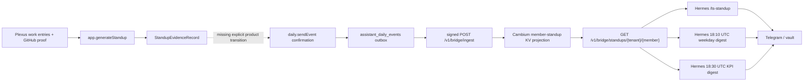

# Plexus → Hermes Daily Standup Repair Implementation Plan

<!-- documentation-status: 2026-09-05 -->
> **Historical plan / contract.** Original status, approvals, checkboxes, and
> execution instructions are retained as session history. Consult the
> [plan index](README.md), [current ISA](../../ISA.md), and
> [P6 migration plan](../../.planning/phases/P6-labs-migration-acceptance.md) before selecting work.
> This file does not itself start an execution wave or certify current live acceptance.
<!-- /documentation-status -->

> **For Codex:** REQUIRED SUB-SKILL: Use superpowers:executing-plans to implement this plan task-by-task.

**Goal:** Make a generated Plexus standup explicitly publishable, make its delivery state visible, prevent duplicate concurrent sends, and let Hermes replace a persisted no-data placeholder when the real Cambium record arrives.

**Architecture:** Preserve the existing hexagonal path: Plexus owns evidence and an explicit confirmed publish intent; its transactional outbox owns retry; Cambium remains the signed, bounded, redacted read model; Hermes remains the only Telegram renderer/deliverer. The repair adds orchestration and refresh semantics, not a new transport.

**Tech Stack:** Electron, TypeScript, SQLite, Vitest, Cloudflare Worker/KV, Python 3, `unittest`, Hermes EC2 gateway/routines, Telegram topics.

**Tracking:** [Cambium issue #270](https://github.com/Sheshiyer/cambium/issues/270)

---

## Executive finding

Most of the lane is already built and deployed. The current `count:0` does not
show that Cambium or Hermes failed. It shows that no first Plexus
`daily_agent_event` has reached the signed bridge.

The remaining live-smoke instructions contain two incorrect assumptions:

1. Plexus's five-minute `flushAssistantDailyEvents()` timer only retries rows
   already present in `assistant_daily_events`; it never creates the first row.
2. `app.generateStandup` writes `StandupEvidenceRecord` evidence only; it does
   not invoke `daily.sendEvent`.

There is also a Hermes recovery defect: `/ts-standup` writes a no-data markdown
file after a dated 404, but any later invocation exits as soon as that file
exists. A real record that arrives later is therefore hidden by the placeholder.

## Current flow and evidence



| Segment | State | Evidence |
|---|---|---|
| Plexus evidence generation | Implemented | `src/main/assistant-tools.ts` |
| Plexus daily event builder/outbox/bridge-first delivery | Implemented and unit-tested | `src/main/assistant-daily.ts`, `src/main/thoughtseed-bridge.ts` |
| First-event product trigger | Missing from deterministic UI/proactive flow | `daily.sendEvent` is confirm-required but declared-only; Today explicitly omits it |
| Retry timer | Implemented, retry-only | `src/main/main.ts:625-626`, `src/main/assistant-daily.ts:586-650` |
| Cambium projection/read route | Implemented and deployed | commit `b054433`, Worker version `2e1fcd43-ca94-44f3-b649-1212d57b24b1` |
| Hermes command and routine consumers | Implemented and deployed | commit `d21190b` |
| Hermes no-data recovery | Defective | `ops/hermes/plugins/thoughtseed-telegram/ts_commands.py:1574-1608` |
| Founder-visible proof | Not yet captured | Issue #270 S-3 remains open |

## Boundaries that must not change

- `daily.sendEvent` remains `confirm_required`; no automatic or inferred send.
- It remains excluded from the generic automatic model ToolSet.
- Plexus never receives Telegram credentials or Telegram delivery code.
- Cambium continues deriving tenant/member from the signed auth envelope, not payload.
- Cambium continues serving only capped, whitelisted fields.
- The outbox row is persisted before any network delivery is attempted.
- Worker fallback remains degraded transport, not proof of Hermes delivery.
- A real founder-visible receipt is required before closing S-3.

## Options considered

### Option A — expose the existing confirmed publisher (recommended)

After persisted evidence exists, generate a proactive `daily.sendEvent`
suggestion containing the authoritative date, bridge member ID, and
`standupRecordId`. The existing assistant suggestion materializer creates a
persisted intent and the existing confirmation modal executes it.

Advantages:

- Reuses the shipped tool, intent audit, outbox, event schema, and transports.
- Preserves the explicit confirmation boundary.
- Requires no Cambium change and no Telegram change.
- Makes the current two-stage safety model visible: prepare, then publish.

Trade-off:

- The user confirms two separate actions, deliberately.

### Option B — add a composite `daily.publishStandup` use case

One confirmed action would generate evidence and enqueue the event.

Advantages:

- One coherent user action and a smaller interaction burden.

Trade-offs:

- Adds a new public tool/schema and merges two currently distinct safety/audit
  events.
- Requires migration and broader regression coverage.
- Makes evidence-only generation less obvious.

Use only if product direction explicitly changes to “one confirmation publishes.”

### Option C — scheduled unattended publication

Create and send the daily event automatically on a schedule.

Rejected for this repair because it bypasses the current confirm-required
product intent. Treat this as a separate policy decision after S-3 proof.

## Repository scope

| Repository | Required change |
|---|---|
| `plexus-ts` | Add the explicit post-evidence publish suggestion, delivery-state visibility, and concurrent idempotency hardening |
| `hermes-aws-ts` | Mark no-data versus real files and permit only no-data → real replacement |
| `cambium` | No code change for this repair |

---

## Task 1: Characterize the producer orchestration gap

**Files:**

- Modify: `test/assistant/offline-suggestions.test.ts`
- Modify: `test/assistant/proactive-suggestions.test.ts`
- Modify: `test/assistant/today-snapshot.test.ts`
- Modify: `test/assistant/today-renderer-contract.test.ts`

### Step 1: Write failing post-evidence suggestion tests

Add cases proving:

1. Work without standup evidence suggests `app.generateStandup`.
2. Standup evidence with a bridge member and no sent outbox record suggests
   `daily.sendEvent`.
3. The publish suggestion payload carries the exact snapshot date, bridge
   member ID, and persisted `standupRecordId`.
4. A sent outbox row suppresses the publish suggestion.
5. A queued or failed row offers a clearly labelled resume/retry suggestion.
6. Missing member authority never invents `"shesh"` or `"anonymous"`.
7. The action remains `confirm_required`.

Expected suggestion:

```ts
{
  id: 'offline_publish_daily_2026-07-27',
  type: 'standup',
  title: 'Publish daily standup',
  safety: 'confirm_required',
  intent: {
    toolId: 'daily.sendEvent',
    title: 'Publish daily standup',
    payload: {
      date: '2026-07-27',
      memberId: 'shesh',
      standupRecordId: 'standup_20260727',
    },
  },
}
```

### Step 2: Prove the tests fail for the intended reason

Run:

```bash
npx vitest run \
  test/assistant/offline-suggestions.test.ts \
  test/assistant/proactive-suggestions.test.ts \
  test/assistant/today-snapshot.test.ts \
  test/assistant/today-renderer-contract.test.ts \
  --no-file-parallelism
```

Expected: failures state that no `daily.sendEvent` suggestion/action exists;
existing standup-generation assertions continue to pass.

### Step 3: Preserve the characterization in the implementation commit

Do not weaken the existing test that proves automatic model ToolSets omit
`daily.sendEvent`. Replace only the Today renderer assertion that globally
forbids the ID with an assertion that it appears solely in the explicit
post-evidence publish path.

---

## Task 2: Surface the existing confirmed Plexus publisher

**Files:**

- Modify: `src/main/assistant-runtime.ts`
- Modify: `src/main/assistant-suggestions.ts`
- Modify: `src/shared/today-snapshot.ts`
- Modify: `src/renderer/components/Timer.tsx`
- Test: files from Task 1

### Step 1: Add delivery state to offline suggestion context

Extend `AssistantOfflineContext` with a nullable daily event state, using the
existing `AssistantDailyEventStatus` type rather than a new string union.

Decision table:

| Evidence | Member | Event state | Action |
|---|---|---|---|
| absent | any | any | `app.generateStandup` |
| present | absent | any | no publish action; show authority/config diagnostic |
| present | present | absent | `daily.sendEvent` — publish |
| present | present | `queued`/`failed` | `daily.sendEvent` — resume/retry |
| present | present | `sent` | no publish action |

Keep the source date from the assistant context/snapshot. Do not recompute it
with a fresh UTC date inside the action.

### Step 2: Resolve existing outbox state before building suggestions

In `listProactiveAssistantSuggestions()`:

1. Derive date from the already-built context.
2. Read member ID from `context.infra.thoughtseedBridge.memberId`.
3. Compute `assistantDailyEventId(date, memberId)`.
4. Read the row using `getAssistantDailyEvent()`.
5. Pass its status into `buildOfflineAssistantSuggestions()`.

Add an injectable resolver to `ListProactiveAssistantSuggestionsOptions` so unit
tests do not depend on the real SQLite database.

Do not mark `daily.sendEvent` as generally `available`; the suggestion will
still be materialized into a persisted intent by
`materializeAssistantSuggestionIntents()` and confirmed through the existing
modal.

### Step 3: Make Today show the pending publication transition

In `buildTodaySnapshot()`:

- When evidence is ready and the normalized assistant suggestions contain
  `daily.sendEvent`, add a `publish-daily-standup` next action routed to Clio.
- When sent, omit that action and render the existing founder-ready state.
- When failed, use warning/error copy that says the event is queued for retry,
  rather than implying delivery.

In `Timer.tsx`, route the action to the Assistant surface. The Assistant surface
must load the persisted `daily.sendEvent` suggestion and open the existing
confirmation modal when the user selects it.

### Step 4: Re-run focused tests

```bash
npx vitest run \
  test/assistant/offline-suggestions.test.ts \
  test/assistant/proactive-suggestions.test.ts \
  test/assistant/today-snapshot.test.ts \
  test/assistant/today-renderer-contract.test.ts \
  test/assistant/tool-schema.test.ts \
  test/assistant/tool-confirmation.test.ts \
  --no-file-parallelism
```

Expected: all pass; `daily.sendEvent` remains confirm-required and absent from
automatic ToolSets.

---

## Task 3: Harden event idempotency under concurrent confirmations

**Files:**

- Modify: `src/db/database.ts`
- Modify: `src/main/assistant-daily.ts`
- Modify: `test/assistant/daily-event-outbox.test.ts`
- Modify: `test/assistant/daily-event-queue.test.ts`

The event already has the deterministic identity
`assistant_daily_<date>_<member>` and `assistant_daily_events.id` is the SQLite
primary key. Preserve that contract; do not introduce a competing key.

### Step 1: Write failing concurrency tests

Add cases proving:

- Two simultaneous enqueue calls for the same member/date do not throw a
  uniqueness error.
- Only one in-process delivery attempt runs for the same event ID.
- Both callers resolve to the same stored event.
- A stored `sent` event is not sent again.
- A stored `failed` event may be explicitly retried.

### Step 2: Make insertion conflict-safe

Change the insert to:

```sql
INSERT INTO assistant_daily_events (...)
VALUES (...)
ON CONFLICT(id) DO NOTHING
```

Always fetch and return the authoritative row after the insert attempt.

### Step 3: Add per-event single-flight delivery

Wrap `queueAndSendAssistantDailyEvent()` with an in-process promise map keyed by
`event.eventId`. Concurrent callers await the same enqueue/delivery promise.
Remove the map entry in `finally`.

This is an Electron single-main-process guard. Cambium's deterministic message
ID and date/member projection remain the downstream idempotency boundary.

### Step 4: Run outbox tests

```bash
npx vitest run \
  test/assistant/daily-event-builder.test.ts \
  test/assistant/daily-event-outbox.test.ts \
  test/assistant/daily-event-queue.test.ts \
  test/assistant/daily-event-retry.test.ts \
  test/assistant/daily-bridge-fallback.test.ts \
  --no-file-parallelism
```

Expected: all pass, including the new concurrent case.

---

## Task 4: Make Hermes no-data files self-healing

**Files:**

- Modify: `ops/hermes/plugins/thoughtseed-telegram/ts_commands.py`
- Modify: `ops/hermes/plugins/thoughtseed-telegram/test_ts_commands.py`

### Step 1: Write failing refresh-order tests

Add cases for:

1. First call receives `standup_not_found` and writes no-data; second call
   receives a real record and replaces the file with real markdown.
2. A real file is never overwritten by a later no-data response.
3. A legacy no-data file written before markers existed is recognized and
   healed.
4. A legacy real file remains protected.
5. Two same-date invocations serialize and leave a complete file.
6. No token or secret-shaped field reaches the file or command response.

Run:

```bash
python3 -m unittest \
  ops/hermes/plugins/thoughtseed-telegram/test_ts_commands.py
```

Expected: the new no-data → real case fails because the second invocation
currently returns “already generated.”

### Step 2: Add explicit file identity

Add bounded metadata near the top of both renderers:

```text
standup-state: real
eventId: assistant_daily_20260727_shesh
```

and:

```text
standup-state: no-data
```

Create a bounded parser that classifies:

- marker `standup-state: real` → `real`
- marker `standup-state: no-data` → `no-data`
- legacy “Real Plexus data” → `real`
- legacy “Explicit no-data state” / “No standup data received” → `no-data`
- anything else → `unknown`

Unknown existing content must not be overwritten automatically.

### Step 3: Apply the replacement rule

Within a per-path `asyncio.Lock`:

1. Existing `real` or `unknown` file: return without fetching or overwriting.
2. Missing or `no-data` file: fetch the dated Cambium route.
3. Real response: atomically replace missing/no-data with real markdown.
4. Not-found response: re-check the current file state; never replace `real`.
5. Transport/auth/schema failure: write nothing.

Write through a temporary file in the same directory, flush it, then use
`os.replace()` so readers never observe partial markdown.

### Step 4: Re-run the Hermes suite

```bash
python3 -m unittest \
  ops/hermes/plugins/thoughtseed-telegram/test_ts_commands.py
```

Expected: all existing and new cases pass.

---

## Task 5: Preserve Cambium as a verified boundary

**Files:**

- No source changes expected.
- Verify: `workers/quests/src/handler.ts`
- Verify: `workers/quests/src/handler.test.ts`

From the Cambium repository, run:

```bash
node --test workers/quests/src/handler.test.ts
```

Verify these invariants remain green:

- signed member-scoped ingest
- tenant/member derived from auth envelope
- deterministic `standup:<tenant>:<member>:<date>` key
- event ID and standup record ID preserved
- project/blocker rows and text bounded
- anonymous/cross-member/cross-tenant reads rejected
- dated miss returns `standup_not_found`
- recent empty state returns `count: 0`
- no token or Telegram material in stored/served projection

Do not modify or redeploy Cambium unless this verification exposes a genuine
contract regression.

---

## Task 6: Cross-repository verification

### Step 1: Plexus regression suite

```bash
npm run test:assistant
npm run typecheck
npm run build:main
npm run smoke:thoughtseed-bridge
```

### Step 2: Hermes regression suite and deploy dry run

```bash
python3 -m unittest \
  ops/hermes/plugins/thoughtseed-telegram/test_ts_commands.py
scripts/deploy-ec2-release.sh --dry-run
```

### Step 3: Inspect only the intended diff

In each repository:

```bash
git status --short
git diff --check
git diff -- \
  src/main/assistant-runtime.ts \
  src/main/assistant-suggestions.ts \
  src/shared/today-snapshot.ts \
  src/renderer/components/Timer.tsx \
  src/main/assistant-daily.ts \
  src/db/database.ts \
  test/assistant
```

For Hermes:

```bash
git diff --check
git diff -- \
  ops/hermes/plugins/thoughtseed-telegram/ts_commands.py \
  ops/hermes/plugins/thoughtseed-telegram/test_ts_commands.py
```

Do not stage unrelated dirty work.

---

## Task 7: Deploy in dependency order

Deployment is an explicit external action. Execute it only after the
implementation has its own authorization and both worktrees are reviewed.

1. Release the Plexus producer/UI repair.
2. Deploy the Hermes placeholder-refresh repair using the repository release
   script with a clean, reviewed tree.
3. Leave Cambium Worker version
   `2e1fcd43-ca94-44f3-b649-1212d57b24b1` unchanged.
4. Verify Hermes gateway reconnection and routine configuration.
5. Run the corrected live smoke below.

Hermes deployment command:

```bash
scripts/deploy-ec2-release.sh
```

Rollback:

- Plexus: use the existing OTA/native release rollback procedure.
- Hermes: restore the release backup captured by `deploy-ec2-release.sh`.
- Cambium: no rollback is needed because this repair does not change it.

---

## Corrected live smoke

Use one date and one authoritative bridge member ID for every hop. Record the
event ID at the start.

### 1. Prepare evidence in Plexus

- In Today/Clio, confirm `app.generateStandup` for the snapshot date.
- Verify the resulting `StandupEvidenceRecord` exists and capture
  `standupRecordId`.
- Confirm the UI now offers “Publish daily standup.”

### 2. Explicitly publish

- Confirm the persisted `daily.sendEvent` intent.
- Verify the payload date, member ID, and record ID before confirmation.
- Verify the outbox row ID is
  `assistant_daily_<date-without-separators>_<member>`.
- Verify status is `sent` for bridge success, or visibly queued/failed for retry.

Do not wait for the five-minute flush to create the event; it cannot.

### 3. Verify Cambium independently

Query the exact date through an authorized admin/assignment/member-scoped probe:

```text
GET /v1/bridge/standups/cambium/<memberId>?date=<YYYY-MM-DD>
```

Require:

- HTTP 200
- schema `cambium.member-standup.v1`
- matching `eventId`, `standupRecordId`, date, and member
- real work/project/blocker values

### 4. Verify Hermes command recovery

- If `/ts-standup` previously wrote a no-data file, leave it in place to test
  the repair.
- Send `/ts-standup <memberId> <YYYY-MM-DD>`.
- Require “written from Plexus data,” not “already generated.”
- Open the vault file and verify `standup-state: real`, matching event ID,
  work totals, proof state, projects, and blockers.

### 5. Verify routine rendering before delivery

Run the routine context locally/on EC2 with the correct routine ID and inspect
the “Member standups (Plexus)” section without sending Telegram:

```bash
THOUGHTSEED_ROUTINE_ID=daily-standup-digest \
python3 ops/hermes/thoughtseed-routine-context.py
```

Then repeat with:

```bash
THOUGHTSEED_ROUTINE_ID=plexus-kpi-standup \
python3 ops/hermes/thoughtseed-routine-context.py
```

Require the same latest date and non-zero record count.

### 6. Capture founder-visible proof

- Weekday 18:10 UTC digest → Telegram topic `798`.
- Daily 18:30 UTC KPI standup → Telegram topic `802`.
- Capture message IDs/screenshots and correlate them to the Plexus event ID/date.

Only after this step may S-3 be marked complete.

### 7. Close S-4

- Update the cross-repository ISA and evidence/retro.
- Add the two root causes and corrected smoke sequence to issue #270.
- Attach commits, test counts, deployed release IDs, Cambium record proof, Hermes
  vault proof, and Telegram receipt proof.
- Close issue #270 only when all evidence is present.

## Explicit deferrals

- Unattended/scheduled Plexus publication.
- A composite one-confirmation generate-and-publish action.
- Multi-day backfill or historical reconciliation.
- A new Cambium/Hermes acknowledgement protocol.
- General messaging/outbox refactoring beyond conflict-safe enqueue.
- Any Telegram delivery code or credentials in Plexus.

## Completion criteria

- Plexus exposes a persisted, confirm-required `daily.sendEvent` intent after
  evidence generation.
- No suggestion is shown after the member/date event is sent.
- Concurrent confirmations do not duplicate or throw.
- Hermes heals existing and new no-data placeholders when real data arrives.
- Hermes never replaces real/unknown content with no-data.
- All focused and repository-level verification commands pass.
- The exact-date Cambium route returns the published event.
- `/ts-standup` renders real data.
- Both routine contexts render the real member standup.
- Telegram founder-visible proof is captured before issue closure.
